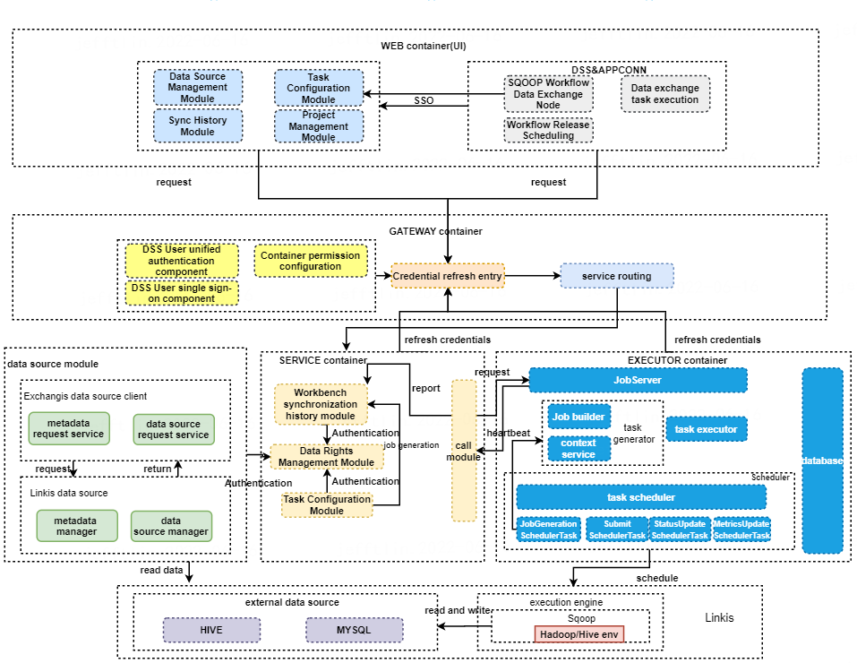

English | [中文](README-ZH.md)  

## Introduction

Exchangis 1.0.0 is a new version of data exchange tool jointly developed by WeDataSphere, a big data platform of WeBank, and community users, which supports the synchronization of structured and unstructured data transmission between heterogeneous data sources.

Exchangis abstracts a unified set of data source and synchronization job definition plugins, allowing users to quickly access new data sources and use them on pages with simple configuration in the database.

Based on the plugin framework design and the computing middleware [Linkis](https://github.com/apache/incubator-Linkis), Exchangis can quickly connect to the data synchronization engine in Linkis, and convert the data synchronization job of Exchangis into the job of Linkis.

With the help of [Linkis](https://github.com/apache/incubator-linkis) computing middleware's connection, reuse and simplification capabilities, Exchangia is inherently equipped with financial-grade data synchronization capabilities of high concurrency, high availability, multi-tenant isolation and resource control. 

###  Interface preview 

## Core characteristics

### 1. Lightweight datasource management  

- Based on Linkis DataSource, Exchangis abstracts all the necessary capabilities of the underlying data source as the Source and Sink of a synchronization job. A data source can be created with simple configuration.

- Special datasource version publishing management function supports version history datasource rollback, and one-click publishing does not need to configure historical datasources again. 

### 2. High-stability and fast-response data synchronization task execution 

- **Near-real-time task management**  
  Quickly capture information such as transmission task log and transmission rate, monitor and display various indicators of multi-task including CPU usage, memory usage, data synchronization record, etc., and support closing tasks in real time.

- **Task high concurrent transmission**  
  Multi-tasks are executed concurrently, and sub-tasks can be copied to show the status of each task in real time. Multi-tenant execution function can effectively prevent tasks from affecting each other during execution. 

- **Self-check of task status**  
  Monitor long-running tasks and abnormal tasks, stop tasks and release occupied resources in time.   

### 3. Integrate with DSS workflow, one-stop big data development portal 

- Realize DSS AppConn's three-level specification, including the first-level SSO specification, the second-level organizational structure specification and the third-level development process specification.

- As the data exchange node of DSS workflow, it is the fundamental process in the whole workflow link, which provides a solid data foundation for the subsequent operation of workflow nodes.

## Overall Design 

### Architecture Design

## Documents

[Quick Deploy](https://github.com/WeBankFinTech/Exchangis/blob/dev-1.0.0/docs/en_US/ch1/exchangis_deploy_en.md)  
[User Manual](https://github.com/WeBankFinTech/Exchangis/blob/dev-1.0.0/docs/en_US/ch1/exchangis_user_manual_en.md)

## Communication and contribution 

If you want to get the fastest response, please mention issue to us, or scan the code into the group ：

## License

Exchangis is under the Apache 2.0 License. See the [License](../../../LICENSE) file for details.

