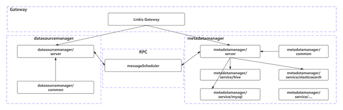
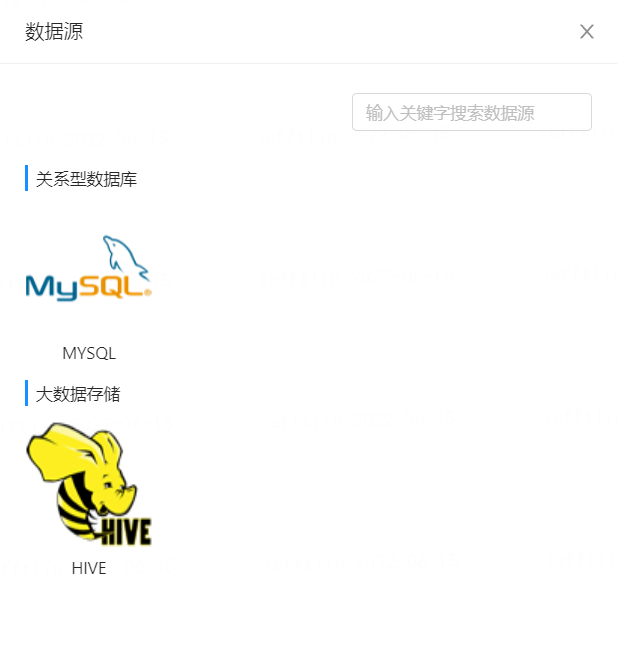
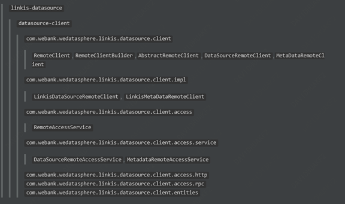
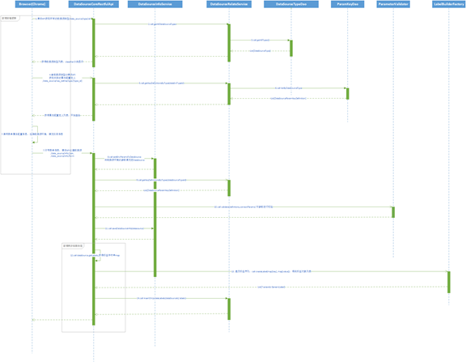

# DataSource1.0

## 1、Background 

The earlier versions of  **Exchangis0.x**and **Linkis0.x** have integrated data source modules, in which **linkis-datasource** is used as the blueprint (please refer to related documents) to reconstruct the data source module. 

## 2、Overall architecture desig 

In order to build a common data source module, the data source module is mainly divided into two parts: **datasource-client** and **datasource-server**, in which the server part is placed in the **linkis-datasource** module of **Linkis-1.0**, including the main logic of the service core; Client is placed under the **exchange is-data source** module of **exchange is-1.0**, which contains the calling logic of the client. Look at the overall architecture  

Figure 2-1 Overall Architecture Design
 

## 3、Detailed explanation of modules  

### 3.1 datasource-server

**datasource-server**: As the name implies, it is a module that stores core services, and it follows the original architecture of **linkis-datasource** (split into **datasourcemanager** and **metadatamanager**)

### 3.2 linkis-datasource

Schematic diagram of current architecture ：

Figure 3-1 Schematic diagram of current architecture
 

It can be seen in the above figure that **linkis-datasource** decouples the related functions of data sources, the basic information part is managed by **datasourcemanager**, and the metadata part is managed by **metadatamanager**. The two sub-modules visit each other through RPC requests, and at the same time, they provide Restful entrances to the outside respectively. The external service requests are uniformly forwarded by **liniks-gateway** before they fall on the corresponding services. Furthermore, **metadatamanage** is connected to the sub-modules of **service** of different data sources in order to plug-in the metadata management platform of the third party. Each sub-module has its own implementation of metadata acquisition interface, such as **service/hive, service/elastic search and service/MySQL** 

#### 3.2.1 New demand 

##### Front end interface requirements 

The original **linkis-datasource** did not include the front-end interface, so now the original data source interface design of **exchangis 1.0** is merged. See **UI document** and **front-end interactive document** for details. Make a detailed description of the requirements involved: 

-  Type of datasource-list acquisition [data source management] 

Description: 

Get all data source types accessed and show them 

-  Datasource environment-list acquisition [data source management] 

Description: 

Get the preset data source environment parameters in the background and display them as a list

-  Add/Modify Datasource-Label Settings [Data Source Management] 

Description: 

Set the label information of the datasource 

-  Connectivity detection [datasource management] 

Description: 

Check the connectivity of connected data sources, and click the Connectivity Monitor button in the data source list 

-  Add/Modify Datasource-Configure and Load [Datasource Management] 

Description: 

In order to facilitate the introduction of new data sources or the attribute expansion of existing data sources, the form configuration of new/modified data sources is planned to adopt the method of background storage+front-end loading. The background will save the type, default value, loading address and simple cascading relationship of each attribute field, and the front-end will generate abstract data structures according to these, and then convert them into DOM operations. 

Process design: 

1. The user selects the datasource type, and the front end requests the background for the attribute configuration list of the data source with the datasource type as the parameter;

2. When the front end gets the configuration list, it first judges the type, selects the corresponding control, then sets the default value and refreshes the interface DOM;

3. After the basic configuration information is loaded and rendered, the values are preloaded and the cascading relationship is established；

4. The configuration is completed, waiting for the user to fill it. 

 Associated UI: 

Figure 3-2 Datasource UI
 

Figure 3-3 Creating MySQL Datasource
 

- Batch Processing-Batch Import/Export [Datasource Management]

Description: 

Batch import and export of datasource configuration. 

##### Backstage demand 

**linkis-datasurce** at present, the background has integrated the relevant operation logic about the data source CRUD, and now the contents related to the label and version are added: 

- datasource permission setting [datasource management] 

Description: 

The background needs to integrate it with the labeling function of Linkis1.4.0, and give the datasource a labeling relationship.

Process design: 

1. Users are allowed to set labels on datasources when they create and modify them；

2. When saving, the tag information is sent to the back end as a character list, and the back end converts the tag characters into tag entities, and inserts and updates the tag；

3. Save the datasource and establish the connection between the datasource and the label. 

- datasource version function [datasource management] 

Description: 

The concept of adding a version to a datasource, the function of which is to publish and update. When updating, a new version is added by default. When publishing, the datasource information of the version to be published covers the latest version and is marked as published. 

#### 3.2.2 Detailing 

Make some modifications and extensions to the entity objects contained in **linkis-datasource**, as follows: 

| Class Name                       | Role                                                         |
| -------------------------------- | ------------------------------------------------------------ |
| DataSourceType                   | Indicates the type of data source                            |
| DataSourceParamKeyDefinition     | Declare data source attribute configuration definition       |
| DataSourceScope[Add]             | There are usually three fields for marking the scope of datasource attributes: datasource, data source environment and default (all) |
| DataSource                       | Datasource entity class, including label and attribute configuration definitions |
| DataSourceEnv                    | The datasource object entity class also contains attribute configuration definitions. |
| DataSourcePermissonLabel[Delete] |                                                              |
| DataSourceLabelRelation[Add]     | Represents the relationship between datasources and permission labels |
| VersionInfo[Add]                 | Version information, including datasource version number information |

2.1  Among them, **DataSourceParamKeyDefinition** keeps the original consistent structure, and adds some attributes to support interface rendering. The detailed structure is as follows: 

| **Field name** | **Field type** | **Remark**                                                   |
| -------------- | -------------- | ------------------------------------------------------------ |
| id             | string         | persistent ID                                                |
| key            | string         | attribute name keyword                                       |
| description    | string         | describe                                                     |
| name           | string         | attribute display name                                       |
| defaultValue   | string         | attribute default value                                      |
| valueType      | string         | attribute value type                                         |
| require        | boolean        | is it a required attribute                                   |
| refId          | string         | another attribute ID of the cascade                          |
| dataSrcTypId   | string         | the associated data source type ID                           |
| refMap[Add]    | string         | cascading relation table, format should be as follows:  value1=refValue1, value2=refValue2 |
| loadUrl[Add]   | string         | upload URL, which is empty by default                        |

2.2 The **DataSource** structure is similar, but it contains label information

| **Field name**   | **Field type** | **Remark**                                                   |
| ---------------- | -------------- | ------------------------------------------------------------ |
| serId            | string         | persistent ID                                                |
| id               | string         | system ID                                                    |
| versions[Add]    | list-obj       | The associated version VersionInfo list                      |
| srcVersion[Add]  | string         | Version, indicating that the data source was created by version information. |
| datSourceName    | string         | Data source name                                             |
| dataSourceDesc   | string         | Description of data source                                   |
| dataSourceTypeId | integer        | Data source type ID                                          |
| connectParams    | map            | Connection parameter dictionary                              |
| parameter        | string         | Connection attribute parameters                              |
| createSystem     | string         | The created system is usually empty or (exchange is)         |
| dataSourceEnvId  | integer        | The associated data source environment ID of                 |
| keyDefinitions   | list-object    | List of associated attribute configuration definitions.      |
| labels[Add]      | map            | Tag string                                                   |
| readOnly[Add]]   | boolean        | Is it a read-only data source                                |
| expire[Add]]     | boolean        | Is it expired                                                |
| isPub[Add]       | boolean        | Publish                                                      |

2.3 **VersionInfo**  version information. Different versions of data sources mainly have different connection parameters. The structure is as follows: 

| **Field name** | **Field type** | **Remark**                    |
| -------------- | -------------- | ----------------------------- |
| version        | string         | version number                |
| source         | long           | The associated data source ID |
| connectParams  | map            | Version parameter dictionary  |
| parameter      | string         | Version parameter string      |

2.4  **DataSourceType** and **DataSourceEnv** are also roughly the same as the original classes, in which **DataSourceType** needs to add **classifier** fields to classify different datasource types, and the others will not be described. 

The main service processing classes of **datasource-server** are as follows: 

| **Interface name**              | **Interface role**                                           | **Single realization** |
| ------------------------------- | ------------------------------------------------------------ | ---------------------- |
| DataSourceRelateService         | The operation of declaring datasource association information includes enumerating all datasource types and attribute definition information under different types | Yes                    |
| DataSourceInfoService           | Declare the basic operation of datasource/datasource environment | Yes                    |
| MetadataOperateService          | Declare the operation of datasource metadatasource, which is generally used for connection test | Yes                    |
| BmlAppService                   | Declare the remote call to BML module to upload/download the key file of datasource | Yes                    |
| DataSourceVersionSupportService | Declare the operations supported by multiple versions of the datasource | Yes                    |
| MetadataAppService[Old]         | Declare operations on metadata information                   | Yes                    |
| DataSourceBatchOpService[Add]   | Declare batch operations on datasources                      | Yes                    |
| MetadataDatabaseService[Add]    | Declare operations on metadata information of database classes | Yes                    |
| MetadataPropertiesService[Add]  | Operation of declaring metadata information of attribute class | Yes                    |

### 3.3 datasource-client

**datasource-client**:  contains the client-side calling logic, which can operate the data source and obtain relevant metadata in the client-side way. 

#### 3.3.1 Related demand 

##### Backstage demand 

As the requesting client, **datasource-client** has no front-end interface requirements, and its back-end requirements are relatively simple. It not only builds a stable, retryable and traceable client, but also directly interfaces with all interfaces supported by sever, and supports various access modes as much as possible. 

#### 3.3.2 Detailing 

Its organizational structure is generally designed as follows ：

Figure 3-4 Detailed Design of datasource-client
 

The class/interface information involved is as follows: 

| Class/interface name          | Class/interface role                                         | Single realization |
| ----------------------------- | ------------------------------------------------------------ | ------------------ |
| RemoteClient                  | The top-level interface of the Client declares the common interface methods of initialization, release and basic permission verification | No                 |
| RemoteClientBuilder           | Client's construction class is constructed according to different implementation classes of RemoteClient | Yes                |
| AbstractRemoteClient          | The abstract implementation of remote involves logic such as retry, statistics and caching | Yes                |
| DataSourceRemoteClient        | Declare all operation portals of the data source client      | No                 |
| MetaDataRemoteClient          | Declare all operation portals of metadata client             | No                 |
| LinkisDataSourceRemoteClient  | Datasource client implementation of linkis-datasource        | Yes                |
| LinkisMetaDataRemoteClient    | Metadata client implementation of linkis-datasource          | Yes                |
| MetadataRemoteAccessService   | Declare the interface of the bottom layer to access the remote third-party metadata service. | Yes                |
| DataSourceRemoteAccessService | Declare the interface of the bottom layer to access the remote third-party datasource service | Yes                |

The class relationship group diagram is as follows：

Figure 3-5 datasource-client Class Relationship Group Diagram
 

##### Process sequence diagram: 

Next, combining all modules, the calling relationship between interfaces/classes in the business process is described in detail :

- Create datasource 

Focus：

1. Before creating a datasource, you need to pull the datasource type list and the attribute configuration definition list of the datasource corresponding to the type. In some cases, you also need to pull the datasource environment list ；

2. There are two scenarios for creating datasources, one is created through the interface of **linkis-datasource**, and the other is created through the datasource-client of **exchangis**；

3. Datasource type, attribute configuration definition and datasource environment can be added in the background library by themselves. Currently, there is no interface dynamic configuration method (to be provided). 

Now look at the timing diagram of creating a data source: 

Figure 3-6 Sequence diagram of datasource created datasource-client
 

Continue to look at creating data source interface through **datasource-client**:

Figure 3-7 Sequence diagram of datasource created datasource-client call
 

Some additional methods, such as client connection authentication, request recording and life cycle monitoring, are omitted in the above figure, but the whole calling process is simplified 

- Update datasource

Focus:

1. There are two ways to update: version update and ordinary update. Version update will generate a new version of datasource (which can be deleted or published), while ordinary update will overwrite the current datasource and will not generate a new version；

2. Only the creator and administrator users of the datasource can update the publication datasource. 

Figure 3-8 datasource-client Update Datasource Timing Diagram
 

- Query datasource

Focus :

1. When you get the datasource list through datasource-client, you need to attach the operating user information for permission filtering of the datasource

Database design :

Figure 3-9 datasource-client Query Datasource Sequence Diagram
 

Interface design: (refer to the existing interface of linkis-datasource for supplement) 