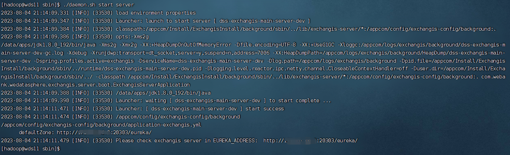

## Foreword 

Exchangis installation is mainly divided into the following four steps ：

1. Exchangis dependent on environmental preparation 
2. Exchangis  installation and deployment 
3. DSS ExchangisAppConn installation and deployment 
4. Linkis Sqoop engine installation and deployment

## 1. Exchangis dependent on environmental preparation 

#### 1.1 Basic software installation 

| Dependent components                                                         | Must be installed | Install through train |
|------------------------------------------------------------------------------| ------ | --------------- |
| JDK (1.8.0_141)                                                  | yes | [How to install JDK](https://www.oracle.com/java/technologies/downloads/) |
| MySQL (5.5+)                                                  | yes | [How to install mysql](https://www.mysql.com/downloads/) |
| Hadoop(3.3.4，Other versions of Hadoop need to compile Linkis by themselves.) | yes | [Hadoop deployment](https://www.apache.org/dyn/closer.cgi/hadoop/common/hadoop-3.3.4/hadoop-3.3.4.tar.gz) |
| Hive(2.3.3，Other versions of Hive need to compile Linkis by themselves.)     | yes | [Hive quick installation](https://www.apache.org/dyn/closer.cgi/hive/) |
| SQOOP (1.4.6)                                                                | yes | [How to install Sqoop](https://sqoop.apache.org/docs/1.4.6/SqoopUserGuide.html) |
| DSS1.1.2                                                                     | yes | [How to install DSS](https://github.com/WeBankFinTech/DataSphereStudio-Doc/tree/main/zh_CN/%E5%AE%89%E8%A3%85%E9%83%A8%E7%BD%B2) |
| Linkis1.4.0                                                                  | yes | [How to install Linkis](https://linkis.apache.org/zh-CN/docs/1.4.0/deployment/deploy-quick) |
| Nginx                                                                        | yes | [How to install Nginx](http://nginx.org/) |

Underlying component checking 

$\color{#FF0000}{Note: be sure to reinstall dss1.1.2, and linkis1.4.0. Please recompile linkis and use the package released on June 15th }$

[linkis1.4.0 code address ](https://github.com/apache/incubator-linkis/tree/release-1.4.0)    

[DSS1.1.2 code address ](https://github.com/WeBankFinTech/DataSphereStudio/tree/dev-1.1.2)

datasource enabled 

By default, two services related to datasources (ps-data-source-manager, ps-metadatamanager) will not be started in the startup script of linkis. If you want to use datasource services, you can start them by modifying the export enable _ metadata _ manager = true value in $ linkis_conf_dir/linkis-env.sh. When the service is started and stopped through linkis-start-all.sh/linkis-stop-all.sh, the datasource service will be started and stopped. For more details about data sources, please refer to [Data Source Function Usage](https://linkis.apache.org/zh-CN/docs/1.1.0/deployment/start-metadatasource) 

#### 1.2 Create Linux users 

Please keep the deployment user of Exchangis consistent with that of Linkis, for example, the deployment user is hadoop account. 

#### 1.3 在linkis中为exchangis加专用token

###### 1）Add special token to exchangis in linkis:

```sql
INSERT INTO `linkis_mg_gateway_auth_token`(`token_name`,`legal_users`,`legal_hosts`,`business_owner`,`create_time`,`update_time`,`elapse_day`,`update_by`) VALUES ('EXCHANGIS-AUTH','*','*','BDP',curdate(),curdate(),-1,'LINKIS');
```

###### 2）Authentication of hive data source for exchangis 

Insert hive data source environment configuration by executing the following sql statement in linkis database. Note that ${HIVE_METADATA_IP} and ${HIVE_METADATA_PORT} in the statement need to be modified before execution, for example:${HIVE_METADATA_IP}=127.0.0.1，${HIVE_METADATA_PORT}=3306：

```sql
INSERT INTO `linkis_ps_dm_datasource_env` (`env_name`, `env_desc`, `datasource_type_id`, `parameter`, `create_time`, `create_user`, `modify_time`, `modify_user`) VALUES ('开发环境SIT', '开发环境SIT', 4, '{"uris":"thrift://${HIVE_METADATA_IP}:${HIVE_METADATA_PORT}", "hadoopConf":{"hive.metastore.execute.setugi":"true"}}',  now(), NULL,  now(), NULL);
INSERT INTO `linkis_ps_dm_datasource_env` (`env_name`, `env_desc`, `datasource_type_id`, `parameter`, `create_time`, `create_user`, `modify_time`, `modify_user`) VALUES ('开发环境UAT', '开发环境UAT', 4, '{"uris":"thrift://${HIVE_METADATA_IP}:${HIVE_METADATA_PORT}", "hadoopConf":{"hive.metastore.execute.setugi":"true"}}',  now(), NULL,  now(), NULL);
```

If the hive data source needs kerberos authentication when deployed, you need to specify a parameter keyTab in the parameter field of the Linkis_ps_dm_datasource_env table, and the way to obtain its value can be seen: [Setting and authenticating hive data source in linkis](https://linkis.apache.org/zh-CN/docs/latest/auth/token). 

#### 1.4  Underlying component checking 

Please ensure that DSS1.1.2 and Linkis1.4.0 are basically available. HiveQL scripts can be executed in the front-end interface of DSS, and DSS workflows can be created and executed normally. 

## 2. Exchangis installation and deployment 

### 2.1  Prepare installation package 

#### 2.1.1  Download binary package 

Download the latest installation package from the Released release of Exchangis [click to jump to the release interface](https://github.com/WeBankFinTech/Exchangis/releases/tag/release-1.1.2).

#### 2.1.2  Compile and package 

 Execute the following command in the root directory of the project: 

```shell script
  mvn clean install 
```

 After successful compilation, the installation package will be generated in the `assembly-package/target` directory of the project. 

### 2.2  Unzip the installation package 

 Execute the following command to decompress: 

```shell script
  tar -zxvf wedatasphere-exchangis-{VERSION}.tar.gz
```

 The directory structure after decompression is as follows: 

```html
|-- config：One-click installation deployment parameter configuration directory
|-- db：Database initialization SQL directory
|-- exchangis-extds
|-- packages：Exchangis installation package directory
	|-- exchangis-extds：exchangis datasource library
	|-- lib：library
|-- sbin：Script storage directory
```

### 2.3 Modify configuration parameters 

```shell script
  vim config/config.sh
```

```shell script
#IP of LINKIS_GATEWAY service address, which is used to find linkis-mg-gateway service.
LINKIS_GATEWAY_HOST= 

#The LINKIS_GATEWAY service address port is used to find linkis-mg-gateway service.       
LINKIS_GATEWAY_PORT=       

#The URL of LINKIS_GATEWAY service address is composed of the above two parts.
LINKIS_SERVER_URL=

#Token used to request verification of linkis service, which can be obtained in ${LINKIST_INSTALLED_HOME}/conf/token.propertis of linkis installation directory.
LINKIS_TOKEN=

#Eureka service port
EUREKA_PORT=

#Eureka service URL
DEFAULT_ZONE=
```

### 2.4 Modify database configuration 

```shell script
  vim config/db.sh
```

```shell script
# Set the connection information of the database.
# Include IP address, port, user name, password and database name.
MYSQL_HOST=
MYSQL_PORT=
MYSQL_USERNAME=
MYSQL_PASSWORD=
DATABASE=
```

### 2.5 Installation and startup 

#### 2.5.1  Execute one-click installation script. 

 Execute the install.sh script to complete the one-click installation and deployment: 

```shell script
 sh sbin/install.sh
```

#### 2.5.2  Installation step 

 This script is an interactive installation. After executing the install.sh script, the installation steps are divided into the following steps: 

1.	 Initialize database tables. 

 When the reminder appears: Do you want to confiugre and install project?

 Enter `y` to start installing Exchange IS service, or `n` to not install it. 

#### 2.5.3  Change the path of the configuration file and log file

In the 'env.properties' file in the sbin directory, set the configuration file path and log file path

```yaml
EXCHANGIS_CONF_PATH="/appcom/config/exchangis-config/background"
EXCHANGIS_LOG_PATH="/appcom/logs/exchangis/background"
MODULE_DEFAULT_PREFIX="dss-exchangis-main-"
MODULE_DEFAULT_SUFFIX="-dev"
```

EXCHANGIS_CONF_PATH indicates the configuration file path, and EXCHANGIS_LOG_PATH indicates the log file path. If the preceding configurations are used, perform the following operations:

```yaml
cd {EXCHANGIS_DEPLOY_PATH}
cp -r config /appcom/config/exchangis-config/background
mkdir -p /appcom/logs/exchangis/background
```

When the service is started, the configuration file in the corresponding path is used and logs are written to the corresponding path

#### 2.5.4 Start service 

Execute the following command to start Exchangis Server: 

```shell script
  sh sbin/daemon.sh start server
```

 You can also use the following command to restart Exchangis Server: 

```shell script
./sbin/daemon.sh restart server
```

After executing the startup script, the following prompt will appear, eureka address will also be typed in the console when starting the service: 



### 2.6  Check whether the service started successfully. 

You can check the success of service startup in Eureka interface. Check the method: 

Use http://${EUREKA_INSTALL_IP}:${EUREKA_PORT}. It is recommended to open it in Chrome browser to see if the service is registered successfully. 

As shown in the figure below: 


### 2.7  Front-end installation and deployment 

#### 2.7.1  Get the front-end installation package 

Exchangis has provided compiled front-end installation package by default, which can be downloaded and used directly ：[Click to jump to the Release interface](https://github.com/WeBankFinTech/Exchangis/releases/download/release-1.0.0-rc1/web-dist.zip)

You can also compile the exchange front-end by yourself and execute the following command in the exchanise root directory:

```shell script
  cd web
  npm i
  npm run build
```

Get the compiled dist.zip front-end package from the `web/` path. 

The acquired front-end package can be placed anywhere on the server. Here, it is recommended that you keep the same directory as the back-end installation address, place it in the same directory and unzip it. 

#### 3.3.4  Front-end installation deployment 

1.  Decompress front-end installation package 

 If you plan to deploy Exchange is front-end package to the directory `/appcom/install/Exchange is/web`, please copy ` dist.zip to the directory and extract it: 

```shell script
  # Please copy the exchange front-end package to `/appcom/install/exchange/web` directory first.
  cd /appcom/Install/exchangis/web
  unzip dist.zip
```

 Execute the following command: 

```shell script
  vim /etc/nginx/conf.d/exchangis.conf
```

```
        server {
            listen       8098; # Access port If this port is occupied, it needs to be modified.
            server_name  localhost;
            #charset koi8-r;
            #access_log  /var/log/nginx/host.access.log  main;
            location /dist {
            root   /appcom/Install/exchangis/web; # Exchangisfront-end deployment directory
            autoindex on;
            }

            location /api {
            proxy_pass http://127.0.0.1:9020;  # The address of the back-end Linkis needs to be modified.
            proxy_set_header Host $host;
            proxy_set_header X-Real-IP $remote_addr;
            proxy_set_header x_real_ipP $remote_addr;
            proxy_set_header remote_addr $remote_addr;
            proxy_set_header X-Forwarded-For $proxy_add_x_forwarded_for;
            proxy_http_version 1.1;
            proxy_connect_timeout 4s;
            proxy_read_timeout 600s;
            proxy_send_timeout 12s;
            proxy_set_header Upgrade $http_upgrade;
            proxy_set_header Connection upgrade;
            }

            #error_page  404              /404.html;
            # redirect server error pages to the static page /50x.html
            #
            error_page   500 502 503 504  /50x.html;
            location = /50x.html {
            root   /usr/share/nginx/html;
            }
        }
```

#### 2.7.3  Start nginx and visit the front page 

 After the configuration is complete, use the following command to refresh the nginx configuration again: 

```shell script
  nginx -s reload
```

Please visit the Exchange front-end page at  http://${EXCHANGIS_INSTALL_IP}:8098/#/projectManage.  The following interface appears, indicating that Exchangis successfully installed on the front end. If you really want to try Exchangis, you need to install dss and linkis, and log in secret-free through dss. As shown in the following figure :


## 3. DSS ExchangisAppConn installation and deployment 

If you want to use Exchangis1.0.0 front-end, you also need to install the DSS ExchangisAppConn plugin. Please refer to: [ExchangisAppConn installation documentation for plugins ](https://github.com/WeBankFinTech/Exchangis/blob/dev-1.0.0/docs/en_US/ch1/exchangis_appconn_deploy_en.md)

## 4. Linkis Sqoop engine installation and deployment 

If you want to execute the Sqoop operation of Exchangis1.0.0 normally, you also need to install the Linkis Sqoop engine. Please refer to: : [Linkis Sqoop engine installation documentation ](https://linkis.apache.org/zh-CN/docs/1.1.2/engine-usage/sqoop/)

## 5.  How to log in and use Exchangis

Exchangis1.0 for more instructions, please refer to the user manual.[Exchangis1.0 user manual](https://github.com/WeBankFinTech/Exchangis/blob/dev-1.0.0/docs/en_US/ch1/exchangis_user_manual_en.md)
