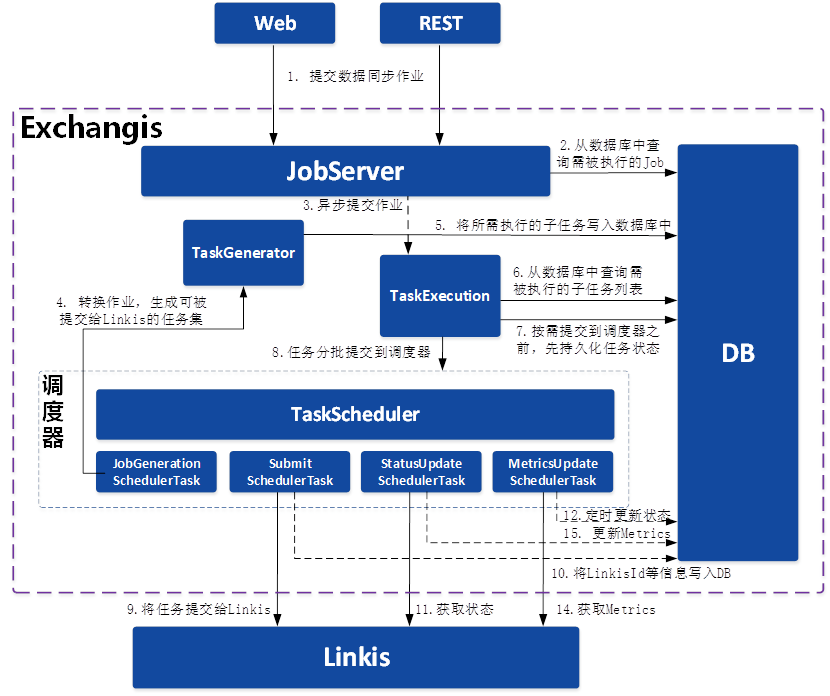
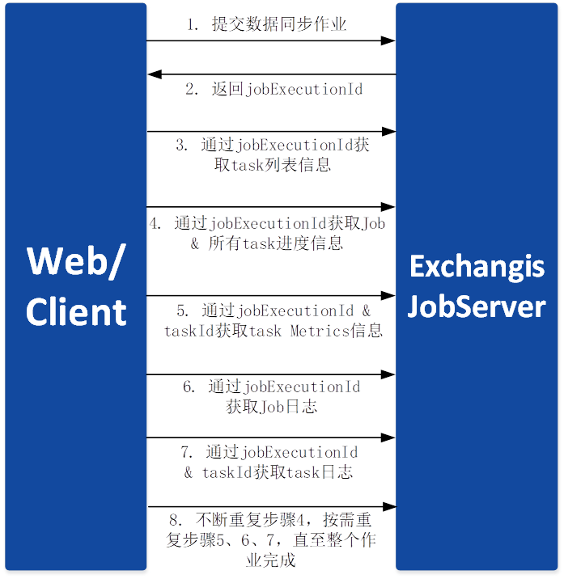
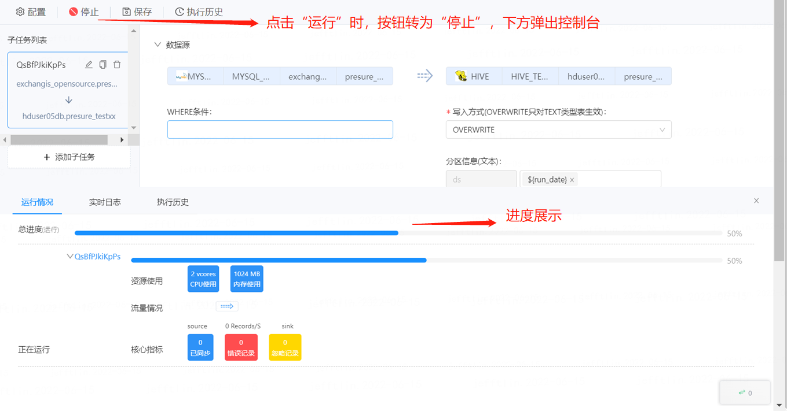
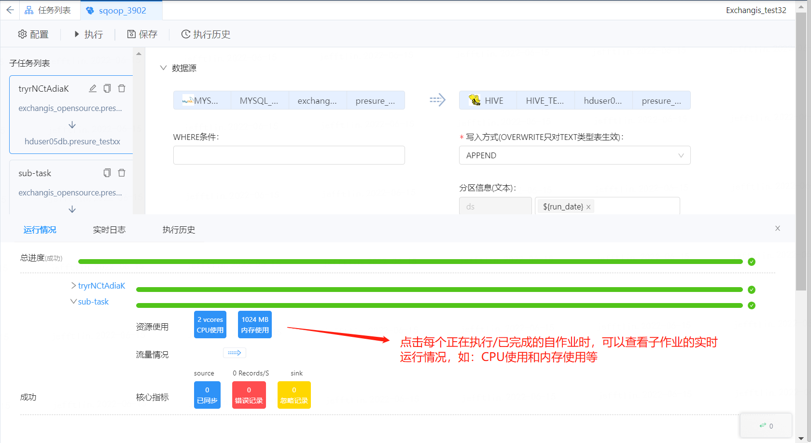
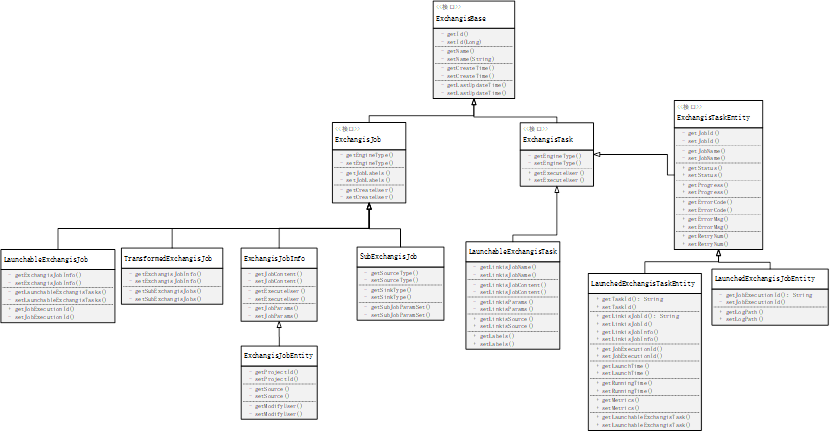
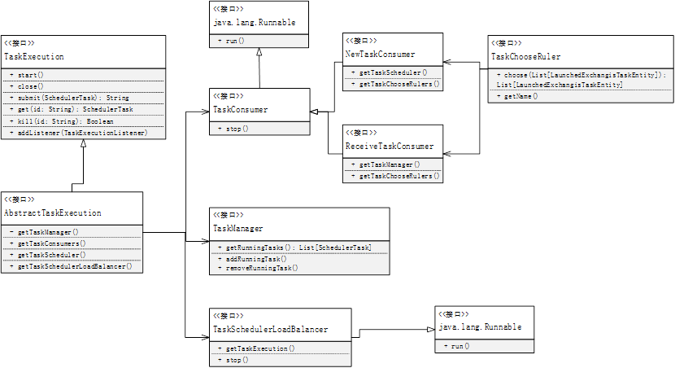
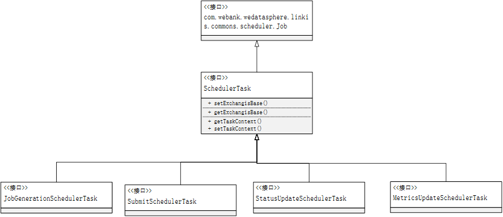
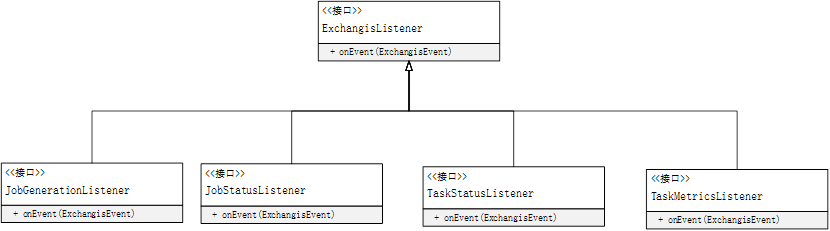

# Exchangis synchronous job execution module detailed design document 

## 一、Overall flow chart 

 

Figure 1-1 General flow chart
 

 Please note that ：

1.   If the user directly submits a JSON of the synchronization task to be executed through the REST client, the JSON can be directly submitted to the TaskGenerator without step 2. 

2.  Every time the front-end or REST client submits, it will generate a JobExecutionId to the front-end, and the subsequent front-end or REST client will obtain the execution status of synchronous job job through jobExecutionId. 

3.  JobExecutionId is best generated and returned when the user submits it, that is, the TaskGenerator should be performed asynchronously. Generally, the TaskGenerator may take several seconds to several minutes (depending on the number of subJob), so if you wait for the TaskGenerator to finish before returning jobExecutionId, the front-end request will probably time out. 

4.  Therefore, only the front-end or REST client generates a jobExecutionId for each submission, which is to support the repeated submission of the same ExchangisJob. Therefore, in principle, JobServer won't check that only one instance of ExchangisJob can be executed at the same time, but the Web front-end should ensure that only one instance of the same ExchangisJob is executed at the same time in the same browser. 

## 二、Front-background interaction 

Figure 2-1 Interaction between foreground and background
 

### 1.  The necessity of jobExecutionId 

Consider the scenario that REST client directly submits a JSON synchronization task that it wants to be executed, and in order to support the repeated submission of the same ExchangisJob, it is necessary to generate a jobExecutionId every time it is submitted. 

JobExecutionId is an execution voucher of ExchangisJob, which will be stored in the database. All subsequent requests about the execution of this ExchangisJob need to bring jobExecutionId. 

1.  The necessity of TaskGenerator asynchrony 

Consider a scenario, that is, after the client submits the job, the client hangs up before Exchangis can return to jobExecutionId. In this case, because jobExecutionId is not printed in the log of the client, the submitting user thinks that the job was not submitted successfully, so there may be data confusion. Furthermore, it may take a long time for TaskGenerator to process an ExchangisJob (depending on the number of subJob), so if you wait for TaskGenerator to finish before returning jobExecutionId, the front-end request will probably time out. 

Therefore, once the JobServer receives the job execution request, it should immediately generate a jobExecutionId, and generate an execution record for this ExchangisJob in the database, and set the execution status as Inited. As long as the database is persisted successfully, it will asynchronously generate the task of TaskGenerator and immediately return to jobExecutionId.

### 2.  Statelessness of JobServer 

This paper discusses whether JobServer is stateless, that is, after the front end gets jobExecutionId, no matter which JobServer instance is requested, it can normally get the desired data in execution. 

Because there is no special information stored in the memory of JobServer, and the ExchangisJob execution status, progress and Metrics information will be stored in the database, when the front-end request is sent, you only need to go to the database to fetch the relevant data. Therefore, the JobServer is stateless. 

### 3.   Multi-tenant function 

Considering the multi-tenant capability, we can split JobGenerator and JobExecution, that is, JobGenerator is used to receive job execution requests submitted by front-end /REST clients in a distributed manner, and JobGenerator generates task sets and stores them in the database. This microservice can be shared by all tenants; While JobExecution can be divided according to different tenants, so as to avoid mutual influence during execution.

### 4.   High availability 

TaskChooseRuler of JobExecution will scan all Exchange Tasks in the database. If an ExchangisTask has not been updated in status after more than a period of time, it will be taken over by the new JobServer.

How to take over? 

A simple takeover means that the JobServer of all other inventories loads this ExchangisTask to the TaskScheduler at the same time. Because it updates the progress, status and Metrics information, although many of them are updated at the same time, it has no impact on the task. 

Complex takeover requires adding a field in the database table of ExchangisTask to identify the JobServer that is executing the ExchangisTask. At this time, multiple job servers will be triggered to grab the ownership of the Exchangistask. Because the scheme is complex, it will not be considered for the time being. 

## 三、Detailed explanation of front-end interaction 

### 1.  Submit 

Before execution, the page is shown in the following figure: 

As the execution interface (with the link to the submission interface attached) needs to be provided with jobId, before actually submitting for execution, it needs to be saved and then submitted, and a basic check should be made before submission, that is, if no subtask or job fails to be saved, it cannot be submitted for execution. 

Figure 3-1 Task submission
 

Click execute, as shown in the figure below: 

Note that the job information desk will pop up at this moment, showing the running status by default, that is, the overall progress and the progress of all subtasks. 

There are two interfaces used in the front end. One is to use the [Execution Interface] first, submit the ExchangisJob for execution, and return the jobExecutionId； in the background; Second, call the [Get Job Progress] interface through jobExecutionId, which is used to get the progress information of Job&all task, and to show the progress of the following pages. 

Figure 3-2 Task Execution
 

### 2.  Operation status of subtasks 

When the user clicks on a running/completed sub-job, the front end triggers the [Get Task Metrics Information] interface in the background of the request, and obtains the task Metrics information through jobExecutionId & taskId, showing the contents of the following page: 

Figure 3-3 Operation of subtasks
 

Show the main resource usage, flow rate and core indicators. 

Figure 3-4 Resource usage of subtasks
 

### 3.  Real-time log 

When the user clicks the "Log" button in the lower right corner as shown in the figure below, the "Real-time Log" Tab will appear at the information desk, and the real-time log of Job will be displayed by default. When you click the "Log" button of the running status, the running log of the whole Job will be displayed by default at first. At this time, the front end will call the interface of "Get Job Real-time Log" by default, and get the job log through jobExecutionId and display it, as shown in the following figure: 

Figure 3-5 Task Real-time Log
 

As long as the user doesn't switch to other tabs of the information desk, the front end will constantly poll the background for real-time logs; 

The user can also select to view the log of a certain task through the select selection box, then trigger the request [Get task Real-time Log] interface, get the task log through jobExecutionId & taskId, and continuously poll the latest log. 

If the user switches the select box, the previous log will not be refreshed. 

It should be Inited here that the background also provides an interface of [Get task List of this Job Execution], which is used to help the front end to get all the task lists and display the contents of the select selection box. If the Job itself is still in the initiated or Scheduled state, but it has not been successfully turned into the Running state, the task list cannot be pulled at this time, so when the user drops down the select selection box, the user should be prompted that "the Job is still being scheduled. Please check the real-time log of subtasks after the Job is turned into the Running state." 

After the operation is completed, if the status is successful, the Tab will be switched back to the operation Tab page; If the status is failed, based on the information returned by the [Get Job Progress] interface, the log of the failed sub-job's task will be displayed by default, and the log of the first failed task will be displayed automatically when multiple tasks fail. 

## 四、Detailed explanation of background design 

### 1.  Table structure design 

Figure 4-1 Database Table Structure Design
 

### 2.   Interface document 

Please refer to the interface document of Exchangis job execution module for details. 

### 3.   Core module & Core class design 

#### 3.1  The UML class diagram of the Bean is as follows: 

 

Figure 4-2 UML class diagram of entity Bean
 

Please note that all non-interfaces ending in Entity need to be stored in the database and exist as a table. 

#### 3.2  The UML class diagram structure of TaskGenerator is as follows: 

Figure 4-3 UML class diagram of TaskGenerator
 

TaskGenerator is only responsible for converting the JSON of a Job into a task set that can be submitted to Linkis for execution (that is, all sub Jobs under the job are translated into an ExchangisTask set), and the translation is written into DB.

It should be noted here that TaskGenerator is executed asynchronously, and we will encapsulate JobGenerationSchedulerTask in the Service layer for asynchronous submission to TaskExecution for execution. 

#### 3.3 The UML class diagram structure of TaskExecution system is as follows: 

Figure 4-4 UML class diagram of Task Execution system
 

1. TaskExecution is mainly composed of TaskConsumer, TaskManager, TaskScheduler and TaskSchedulerLoadBalancer. 

2. TaskManager，mainly used to manage all ExchangisTask； in the Running state under this JobServer; 

3.   TaskConsumer consists of several thread groups with different functions, such as NewTaskCustomer and ReceiveTaskConsumer. Among them, NewTaskConsumer fetch all executable ExchangisTask lists in the initiated state from the database (ExchangisTask lists corresponding to multiple subJob that may include multiple jobs) and submits them to TaskScheduler in batches according to the actual load of Task Scheduler; Before submitting, the status of this task in the database will be updated to Scheduled；; The receiver is used to take over an ExchangisTask that is already in operation, but still has no updated status and Metrics information after a certain period of time, and put the ExchangisTask into the TaskManager to wait for the status to be updated by StatusUpdateSchedulerTask and MetricsUpdateSchedulerTask. TaskChooseRuler is a rule device used to help TaskConsumer filter and select the required ExchangisTask, such as judging whether ExchangisTask can take over, priority strategy and other rules. 

4.   TaskScheduler is a thread pool for scheduling various types of SchedulerTask；; SubmitSchedulerTask is used to asynchronously submit tasks to Linkis for execution, and write key information returned by Linkis, such as Id and ECM information, into DB; StatusUpdateSchedulerTask and MetricsUpdateSchedulerTask are permanent polling tasks that will never stop. They will constantly get the SchedulerTask that is already in the Running state from TaskManager, request status and Metrics information from Linkis regularly, and update the database. 

5. TaskSchedulerLoadBalancer is a loader, which is used to detect the polling situation of Running tasks in TaskManager, the load situation of TaskScheduler and server in real time, and determine how many StatusUpdateSchedulerTask and MetricsUpdateSchedulerTask are finally instantiated by TaskScheduler to poll the status and Metrics information of all running tasks. 

#### 3.4 The UML class diagram of TaskScheduler system is as follows: 

Figure 4-5 UML class diagram of Task Scheduler system
 

 TaskScheduler is implemented based on linkis-scheduler module. 

#### 3.5  The UML class diagram of the Listener system is as follows: 

Figure 4-6 UML class diagram of listener system
 

The Listener system is the core to ensure that all information can be updated to the database, and the implementation classes of these listeners should be all service classes. 