# Exchangis1.0 User Manual

## 一、Product introduction 

&emsp;&emsp; This article is a quick entry document of Exchangis 1.0, covering the basic usage process of Exchangis 1.0. Exchangis a lightweight data exchange service platform, which supports data synchronization between different types of data sources. The platform data exchange process is split, and the concepts of data source, data exchange task and task scheduling are abstracted, so as to achieve the purpose of visual management of data synchronization process. In the actual data transmission process, the characteristics of multiple transmission components can be integrated to achieve horizontal expansion of functions. 

## 二、Login Exchangis1.0

&emsp;&emsp; Exchangis1.0 is currently a part of DSS**data exchange component**, and it can be accessed in the component list by logging in to DSS. Therefore, before using Exchangis 1.0, please make basic deployment of DSS, Exchange IS 1.0, Linkis and other related components to ensure that the components' functions are available. This article will not go into details. See for details:[exchangis_deploy_en](https://github.com/WeBankFinTech/Exchangis/blob/dev-1.0.0/docs/en_US/ch1/exchangis_deploy_en.md)和[exchangis-appconn_deploy_en](https://github.com/WeBankFinTech/Exchangis/blob/dev-1.0.0/docs/en_US/ch1/exchangis_appconn_deploy_en.md)

### 1、Login DSS

&emsp;&emsp; By default, the system uses Linux deployment users of Linkis to log in to DSS. If users of hadoop deploy Linkis and DSS, they can log in directly through the account password: hadoop/hadoop. First log in to the webpage according to the front-end deployment address of DSS, and then enter the account password: hadoop/hadoop to enter DSS. 

### 2、Enter Exchangis

&emsp;&emsp; Exchangis is accessed through DSS. Click on the word: **Home ->DSS Application Components-> Data Exchange-> Enter Exchange**.

Pic2-1 Exchangis1.0 entrance
 

## 三、Datasource management

&emsp;&emsp;This module can configure and manage data sources. As the initial step of data synchronization, Exchangis1.0 currently supports direct data import between mysql and hive. 
The main functions of data source are as follows ：

1.	 Create, edit and delete data sources;
2.	 Search data sources by type and name, and support quick positioning of data sources;
3.	 Data source connection test operation;
4.	 Release and record of historical data source version.

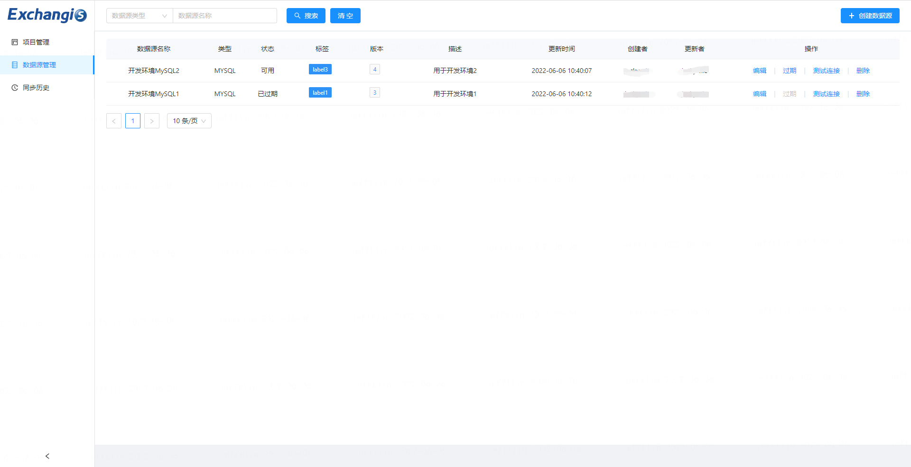

Pic3-1 Datasource management list
 

### 1、Create datasource

&emsp;&emsp; Click **Create Data Source** and select the data source you want to create. Currently, MySQL and Hive data sources can be created. 

Pic3-2 Datasource type
 

&emsp;&emsp;Select the MySQL data source and fill in the configuration parameters, among which the asterisk is required. Make sure that the Host, port number, user name and password connected to MySQL database are connected correctly. **Connection parameter** is in Json format, which is used to set the configuration information of MySQL. After filling it out, you can **test the connection**.

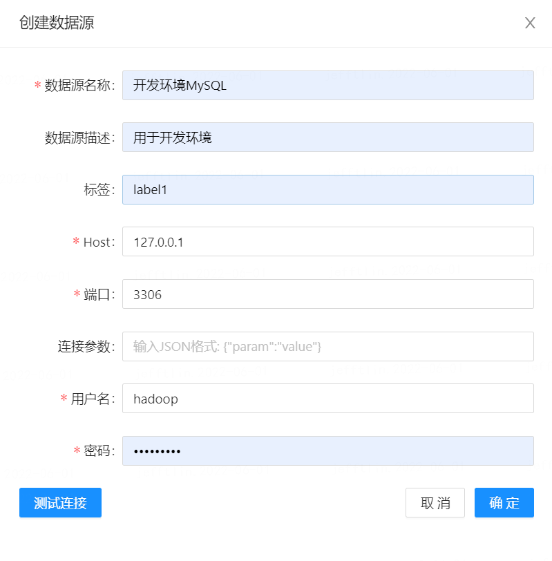

Pic3-3 MySQL datasource config
 

&emsp;&emsp;For the configuration of Hive data source, it is different from MySQL. For the time being, it does not provide users with the function of configuring cluster parameters in the interface. For the cluster environment, it is completed by the back-end unified configuration. Users only need to select the required cluster environment and click OK to save it. 

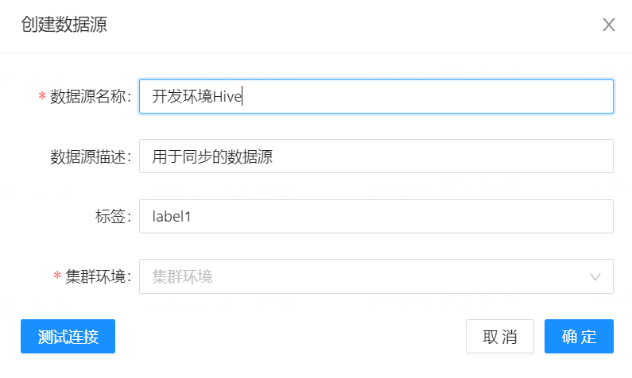

Pic3-4 Hive datasource config
 

### 2、Datasource function

&emsp;&emsp; The data source management module provides the function of **publishing** the version of the configured data source. Only the published data source can be used when configuring derivative tasks, otherwise, it will prompt that it is unavailable. As long as the data source is edited again, it will be regarded as a new version, and the latest version is in the first row. You can **view** the configuration of all historical data source versions in the version list, and you can refer to it whenever you need to roll back. 

Pic3-5 Datasource release
 

&emsp;&emsp;The **expired ** function of data source management is used to indicate that this data source has been gradually replaced. Please change the task configuration using this data source in time to avoid the failure of the configured execution task caused by directly deleting the data source. 
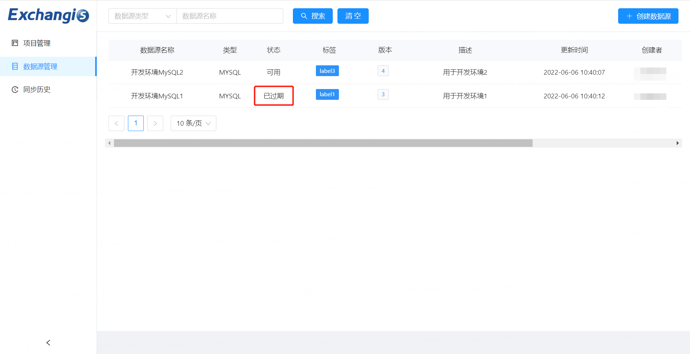

Pic3-6 Datasource expiration
 

## 四、Project management

### 1、Project list

&emsp;&emsp; This module can create projects. In actual derivative tasks, there can be multiple derivative tasks under a project, and different projects do not affect each other. For ordinary users, they can only operate their own created projects. On the homepage of project management, you can manage projects, including **create**, **modify** and **delete** and **query and search**. Modification and deletion can only be performed on projects created in Exchangis.

Pic4-1 Project list
 

### 2、Task list

&emsp;&emsp;Enter the project, and you can see the task list under the project. 

#### 1）Task manage

&emsp;&emsp;You can manage the created Job data synchronization tasks in the task list, similar to projects, including **Create**, **Modify**, **Delete** and **Search**. 

Pic4-2 Task list
 

&emsp;&emsp;  Click **Create Task** to select the task type and execution engine. **Currently, only offline tasks and SQOOP execution engine** are supported, and streaming tasks and DataX engines will be supported in the future. 

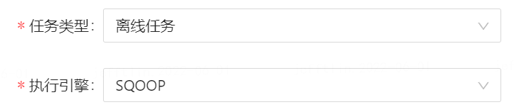

Pic4-3 Task type and Engine config
 

#### 2）Subtasks manage

&emsp;&emsp;Click **Add subtask** in the task to add multiple subtasks. You can **modify, copy and delete subtasks**.

&emsp;&emsp; At the same time, **tasks support copying**, and copied subtasks contain all information of their atomic task configuration. 

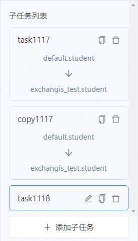

Pic4-4 Subtask manage

#### 3）Synchronize data task configuration and execution 

&emsp;&emsp;Before this step, you need to add data sources in the **data source management module** for selection and **publish**. The current Exchangis version only supports **MySQL data sources and Hive data sources **. 

&emsp;&emsp;Data synchronization task configuration and execution is the core function of Exchangis1.0.0. The basic configuration data synchronization process is: **Add subtask-> Select Source data source and Sink data source-> Field mapping configuration-> Process control-> Task configuration-> Save-> Execute**. 

The main functions of task execution include: 
1.	 Add, copy and delete subtask cards ；
2.	 Realize the import and export of data between two different types of data sources ；
3.	 Selection of library tables for source and destination data sources ；
4.	 Datasource field mapping ；
5.	 Maximum job concurrency and maximum job memory configuration ；
6.	 Data synchronization task execution status view ；
7.	 Log view of each main task and each subtask ；
8.	 Task execution history status view ；
9.	 Execute the task kill operation. 

##### Selecting and configuring data sources 

&emsp;&emsp;For the newly created data synchronization subtask, you should select the data source library table, and the selected data source is the published data source in the **data source module**. Select the data source to support search, and the search method is to search the library first, and then search the table. 

&emsp;&emsp;When MySQL is the destination data source, it supports **insert** and **update** two writing methods; When it is the source data source, it supports **WHERE conditional statement query**.

&emsp;&emsp;When Hive is the destination data source, partition information configuration is supported, and the writing methods are **append data** and **overwrite**; When the source data source is **partition information configuration is supported**.

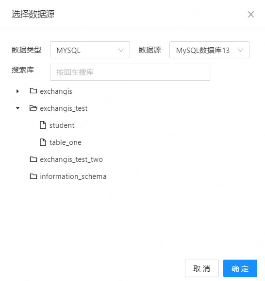

Pic4-5 Select datasource
 

Pic4-6 Write mode configuration
 

##### Datasource field mapping 

&emsp;&emsp;When the data Source library table information is configured, Exchangis1.0.0 will automatically map the fields of source data source and Sink data source, and you can choose the fields you want to map by yourself, or check whether our fields match. When Hive is a Sink data source, its mapping field cannot be modified. 

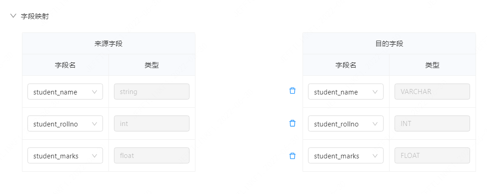

Pic4-7 Field mapping
 

##### Process control

&emsp;&emsp;Task execution provides **configuration of maximum number of parallel jobs** (default is 1) and **configuration of maximum job memory** (default is 1024Mb), which can be changed according to actual needs. 

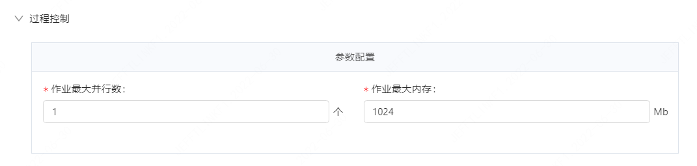

Pic4-8 Process control
 

#### 4）Job execution 

&emsp;&emsp;Exchangis1.0  support the simultaneous execution of multiple subtasks. After the task configuration is completed, click Execute to start the data synchronization task, and the workbench will pop up at the bottom of the interface. The workbench mainly contains three functions: **running status, real-time log and execution history** .
&emsp;&emsp; **Running Status** :You can view the overall progress of the current data synchronization task, including the number of successes and failures of the task, and click on the name of the task to display the information of various running indicators of each task. 

&emsp;&emsp; **Real-time log** :The main display contents include two categories. One is the log of the whole derivative job, which can output the status log of each task, such as whether the task is scheduled or not, and whether it is running moderately; The second is the log of each task, and the output is the corresponding derivative log. In the real-time log, the log can be filtered according to keywords and ignored words, and the function of obtaining the last N lines of logs is provided separately; You can also screen and display different types of logs of Error, Warning and Info, just click the corresponding button. 

&emsp;&emsp; **Execution History** :It can display the historical execution information of this derivative task and provide a preliminary overview of the historical execution process. If you want to further view the detailed historical information, click on the task name to jump to the synchronous history interface for viewing. 

&emsp;&emsp; Data synchronization task execution needs to specify the execution user, which is the login user by default. The specific situation needs to be adjusted according to the configuration of the actual data source. 

## 五、Synchronous history 

&emsp;&emsp; This module can view all data synchronization tasks performed historically, and each user can only view the tasks created by himself. Different users are isolated from each other. 

 The main functions are as follows: 
1.	 Find the required historical task information according to the query conditions ；
2.	 For non-terminal tasks, the function of terminating tasks is provided, which can kill non-terminal tasks ；
3.	 Check the running status and real-time day of each task ；
4.	 View more detailed configuration information and update time of each synchronization task .

Pic5-1 Synchronous history 
 

## 六、Exchangis Appconn uses

&emsp;&emsp; At present, Exchangis1.0 supports docking with DSS in the form of Appconn, **on the DSS side**, data exchange sqoop workflow node can be created in the mode of workflow arrangement through **application development-> project list ** of DSS, where data synchronization tasks can be configured and executed. Exchangis projects and data exchange tasks created in DSS will be created in Exchangis at the same time.

Exchangis Appconn  mainly supports the following functions ：

1. **Project operation ** is the creation, deletion and modification of DSS projects, which will synchronously affect the projects on Exchangis；

2. **Basic operation of workflow node **is the task of creating, deleting and modifying sqoop workflow nodes in DSS choreographer, which will be synchronized to Exchangis.

   It is the task of creating, deleting and modifying sqoop workflow nodes in DSS choreographer, which will be synchronized to Exchangis；

3. **Workflow derivative operation ** support sqoop workflow node configuration to perform data synchronization tasks；

4. **Workflow publishing operation ** support sqoop workflow nodes to publish to WTSS for task scheduling. 

### 1、Project operation 

&emsp;&emsp; This module can create, modify and delete DSS projects, and the operations on the DSS side will be synchronized to the Exchange is side. Here, take the project created in DSS as an example, and the process of operation in Exchange is as follows: **Click Create Project-> Fill in project information-> Click Confirm-> Enter Exchange is side-> Click Project Management**, and you can view the synchronously created projects, as shown in the following figure:

Pic6-1 Project operation
 

After the creation, you will see the synchronized project on the Exchange is side. 

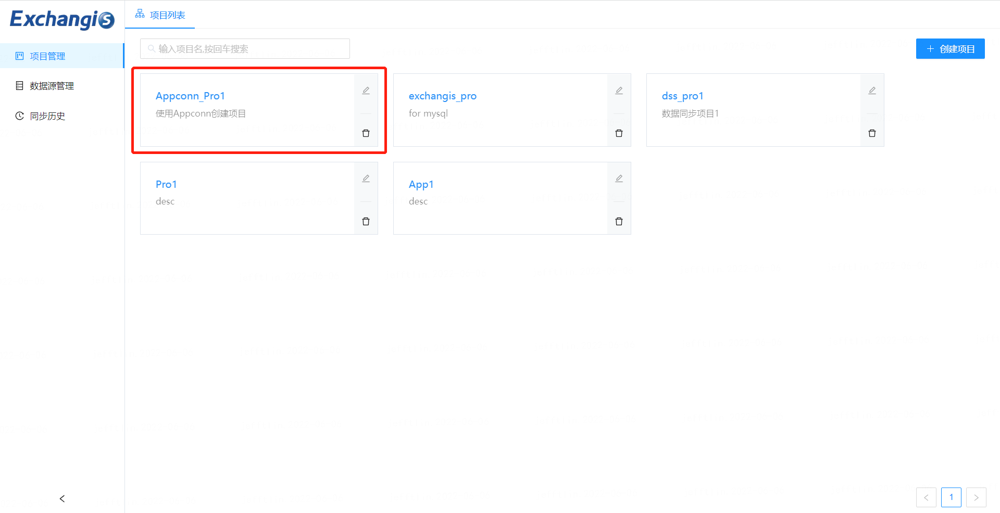

Pic6-2 Synchronize the project into Exchangis
 

### 2、Basic operation of workflow node 

&emsp; Workflow nodes can be created, modified, deleted, and selected depending on each other, and can be associated with each other. Operations on DSS side will be synchronized to Exchangis side. Taking the creation of sqoop workflow node as an example, the operation process of the project in exchangis appconn is as follows: **Create a workflow-> Drag sqoop node from the left plug-in bar to the right canvas-> Click OK to create sqoop node task-> Enter Exchangis to view the synchronously created task**, as shown in the following figure, and the same is true for deleting and modifying sqoop node tasks.

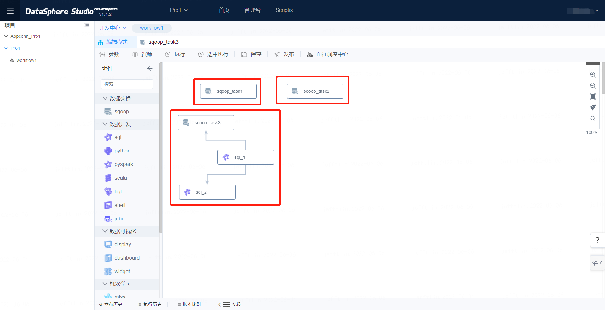

Pic6-3 Sqoop node function
 

 You can see that the derivative task is also synchronized to Exchangis. 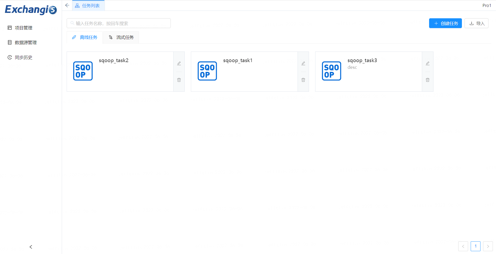

Pic6-4 Synchronize the sqoop node into Exchangis
 

### 3、Workflow derivative operation 

&emsp;&emsp; Double-click the Sqoop node to operate the workflow node. sqoop workflow node configuration and data synchronization tasks are supported. Derivative task in the form of workflow nodes is the core function of Exchangis Appconn **Each sqoop node represents a data synchronization task**, and the specific operation process is as follows: **Double-click the sqoop node-> Task configuration interface pops up-> Configure task information-> Execute task**, as shown in the following figure：

Pic6-5 Double-click the sqoop workflow node to enter the configuration interface.
 

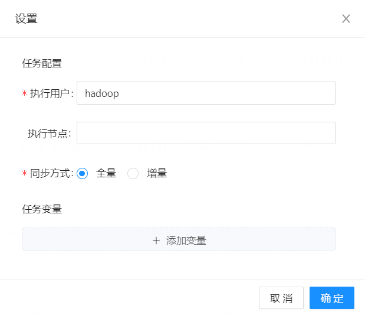

Pic6-6 Configure workflow node information
 

&emsp;&emsp;There are two execution methods here, one is to click the execute button in the pop-up task configuration interface to execute; The other is to click the **Execute button** of DSS choreographer or **select the Execute button** to execute. **Click Execute** to execute all the nodes in this workflow, and **click Select Execute** to execute only the selected workflow nodes, but not all the nodes. 

Pic6-7 Execute job
 

Note: For data synchronization tasks performed in sqoop node of DSS, relevant information can be viewed on Exchangis. 

### 4、Workflow publishing operation

&emsp;&emsp;The **publish** function of workflow tasks supports sqoop workflow nodes to publish to WTSS for task scheduling. The data exchange task information created and configured in the * * Development Center **can be published to WTSS, and the task can be scheduled in WTSS**. 

### 5、Production center 

&emsp;&emsp;Click the drop-down box in the namespace and switch to **Production Center **, where you can see the workflow logs of all projects and check the scheduling status of each workflow. 

Pic6-8 Production center 
 

