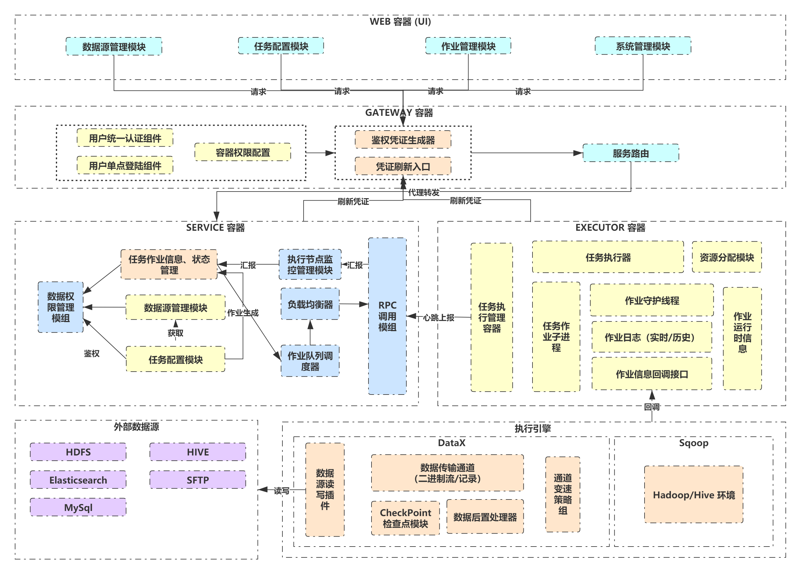

[English](../../../) | 中文  

## 项目简介
Exchangis是一个轻量级的、高扩展性的数据交换平台，支持对结构化及无结构化的异构数据源之间的数据传输，在应用层上具有数据权限管控、节点服务高可用和多租户资源隔离等业务特性，而在数据层上又具有传输架构多样化、模块插件化和组件低耦合等架构特点。

Exchangis的传输交换能力依赖于其底层聚合的传输引擎，其顶层对各类数据源定义统一的参数模型，每种传输引擎对参数模型进行映射配置，转化为引擎的输入模型。每聚合一种引擎，都将增加Exchangis一类特性，对某类引擎的特性强化，都是对Exchangis特性的完善。默认聚合以及强化Alibaba的DataX传输引擎。

## 核心特点
- **数据源管理**  
以绑定项目的方式共享自己的数据源；  
设置数据源对外权限，控制数据的流入和流出。

- **多传输引擎支持**  
传输引擎可横向扩展；  
当前版本完整聚合了离线批量引擎DataX、部分聚合了大数据批量导数引擎SQOOP

- **近实时任务管控**  
快速抓取传输任务日志以及传输速率等信息，实时关闭任务；  
可根据带宽状况对任务进行动态限流  

- **支持无结构化传输**  
DataX框架改造，单独构建二进制流快速通道，适用于无数据转换的纯数据同步场景。

- **任务状态自检**  
监控长时间运行的任务和状态异常任务，及时释放占用的资源并发出告警。  

## 与现有的系统的对比
对现有的一些数据交换工具和平台的对比：  

| 功能模组 | 描述 | Exchangis | DataX | Sqoop | DataLink | DBus |
| :----: | :----: |-------|-------|-------|-------|-------|  
| UI | 集成便捷的管理界面和监控窗口| 已集成 | 无 | 无 | 已集成 |已集成 |
| 安装部署 | 部署难易程度和第三方依赖 | 一键部署，无依赖 | 无依赖 | 依赖Hadoop环境 | 依赖Zookeeper | 依赖大量第三方组件 |
| 数据权限管理|  多租户权限配置和数据源权限管控 | 支持 | 不支持 | 不支持 | 不支持 | 支持 |
|        |动态限流传输 | 支持 | 部分支持，无法动态调整 | 部分支持，无法动态调整| | 支持，借助Kafka |
| 数据传输| 无结构数据二进制传输 | 支持，快速通道 | 不支持 | 不支持 | 不支持，都是记录 | 不支持，需要转化为统一消息格式|
|        | 嵌入处理代码 | 支持，动态编译 | 不支持 | 不支持 | 不支持 | 部分支持 |
|        | 传输断点恢复 | 支持（未开源） | 不支持，只能重试 | 不支持，只能重试 | 支持 | 支持 |
| 服务高可用 | 服务多点，故障不影响使用| 应用高可用，传输单点（分布式架构规划中） | 单点服务（开源版本） | 传输多点 | 应用、传输高可用 | 应用、传输高可用 |
| 系统管理 | 节点、资源管理 | 支持 | 不支持 | 不支持 | 支持 | 支持 |

## 整体设计

### 架构设计

## 相关文档
[安装部署文档](exchangis_deploy_cn.md)  
[用户手册](exchangis_user_manual_cn.md)

## 交流贡献

如果您想得到最快的响应，请给我们提 issue，或者扫码进群：

## License

Exchangis is under the Apache 2.0 License. See the [License](../../../LICENSE) file for details.