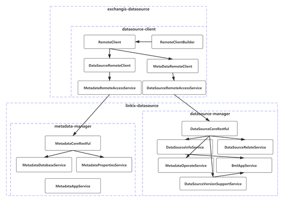
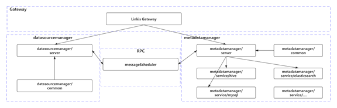
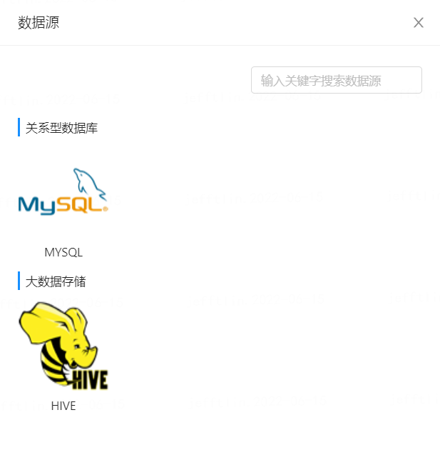
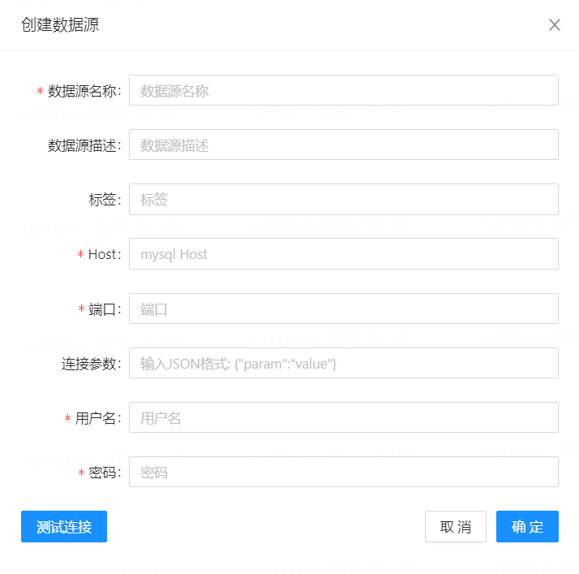
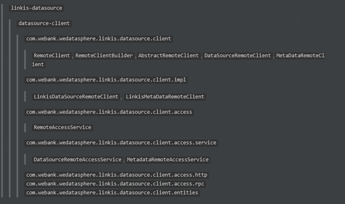
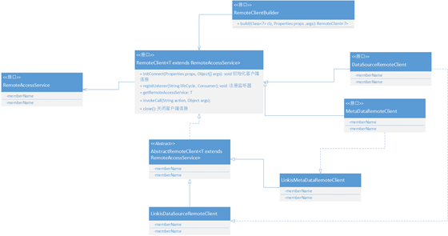
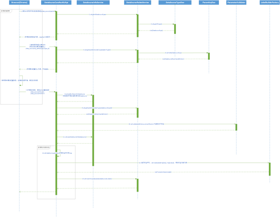
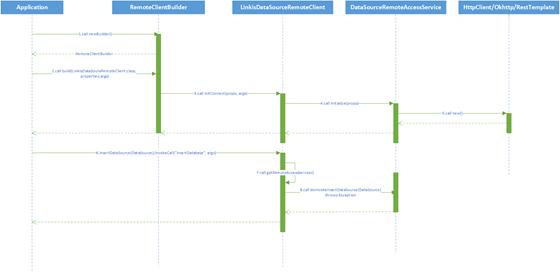
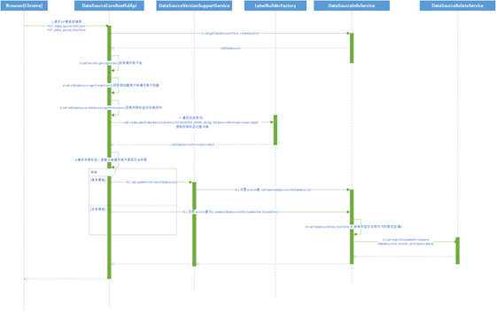
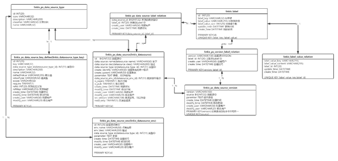

# DataSource1.0

## 1、背景

早期版本中的**Exchangis0.x**和**Linkis0.x**都有整合数据源模块，其中以**linkis-datasource**为蓝本(可以参阅相关的文档)，重构数据源模块。

## 2、整体架构设计 

为了构建公共的数据源模块，数据源模块拆主要拆分成两大部分，**datasource-client**部分和**datasource-server**部分，其中server部分统一放在**Linkis-1.0**的**linkis-datasource**模块中，包含服务核心主逻辑;  client部分放在**Exchangis-1.0**的**exchangis-datasource**模块下， 包含客户端的调用逻辑，看下整体架构。  

图2-1 整体架构设计
 

## 3、模块详解

### 3.1 datasource-server

**datasource-server**: 顾名思义是保存核心服务的模块，沿用**linkis-datasource**原先的架构(拆分成**datasourcemanager** 和 **metadatamanager**)。

### 3.2 linkis-datasource

目前的架构示意图：

图3-1 目前架构示意图
 

上图中可见**linkis-datasource**将数据源相关功能进行了解耦，基础信息部分由**datasourcemanager**进行管理，元数据部分由**metadatamanager**进行管理。两个子模块之间通过RPC请求互相访问，同时分别对外提供Restful入口，外部服务请求统一经过**liniks-gateway**进行转发才落到对应服务上。再者，**metadatamanage**在没有对接第三方元数据管理平台的情况，为了能插件化地支持不同数据源的元数据接入，下接不同数据源的**service**子模块，子模块里都有各自对元数据获取接口的实现，这些模块例如：**service/hive, service/elasticsearch, service/mysql**

#### 3.2.1 新增需求

##### 前端界面需求

原先**linkis-datasource**并不包含前端界面部分，现将原先对**exchangis 1.0**的数据源界面设计合并进去，详见**UI文档**和**前端交互文档**。对其中涉及的需求做下详细描述：

- 数据源类型-列表获取【数据源管理】

需求描述: 

获取接入的所有数据源类型并展示

- 数据源环境-列表获取【数据源管理】

需求描述：

获取在后台预设的数据源环境参数并展示做列表展示

- 新增/修改数据源-标签设置【数据源管理】

需求描述：

设置数据源的标签信息。

- 连接性检测【数据源管理】

需求描述：

检查已经接入的数据源的连通性，通过点击数据源列表的连通性监测按钮。

- 新增/修改数据源-配置加载【数据源管理】

需求描述:

为了方便引入新的数据源或对原有的数据源进行属性扩充，所以对于新建/修改数据源的表单配置，计划采用后台存储+前端加载的方式，后台会保存每条属性字段的类型、默认值、加载地址和简单的级联关系，前端根据这些生成抽象的数据结构，再将其转化成DOM操作

流程设计:

1. 用户选择数据源类型，前端以数据源类型为参数向后台请求该数据源的属性配置列表；

2. 前端拿到配置列表，首先判断类型，选用对应的控件，再设置默认的值，刷新界面DOM；

3. 配置基本信息都加载渲染完成后，开始进行值的预加载和级联关系的建立；

4. 配置加载完成，等待用户填充。

关联UI：

图3-2 数据源UI
 

图3-3 创建MySQL数据源
 

- 批处理-批量导入/导出 【数据源管理】

需求描述:

对数据源配置的批量导入和导出。

##### 后台需求

**linkis-datasurce**后台目前已集成了关于数据源CRUD的相关操作逻辑，现增加和标签、版本相关的内容：

- 数据源权限设置 【数据源管理】

需求描述：

后台需要将其和Linkis1.1.1的标签功能相整合，为数据源赋予标签关系。

流程设计:

1. 用户在创建和修改数据源的时候，允许对数据源进行设置标签；

2. 保存修改时，把标签信息作为字符列表传给后端，后端将标签字符转换为标签实体，插入更新该标签；

3. 保存数据源，建立数据源和标签的联系。

- 数据源版本功能 【数据源管理】

需求描述：

为数据源添加版本的概念，版本的作用在于发布和更新，更新的时候默认添加新版本，发布的时候将要发布的版本的数据源信息覆盖最新版本，并标识为已发布。

#### 3.2.2 详细设计

对**linkis-datasource**包含的实体对象做一些修改和扩充，介绍如下：

| **类名**                         | **作用**                                                     |
| -------------------------------- | ------------------------------------------------------------ |
| DataSourceType                   | 表示数据源的类型                                             |
| DataSourceParamKeyDefinition     | 声明数据源属性配置定义                                       |
| DataSourceScope【新增】          | 标注数据源属性的作用域，通常有三种域，数据源、数据源环境和默认(全部) |
| DataSource                       | 数据源对象实体类，包含标签和属性配置定义                     |
| DataSourceEnv                    | 数据源环境对象实体类，也包含属性配置定义                     |
| DataSourcePermissonLabel【删除】 |                                                              |
| DataSourceLabelRelation【新增】  | 表示数据源和权限标签之间的关系                               |
| VersionInfo【新增】              | 版本信息，包含数据源版本号信息                               |

2.1 其中**DataSourceParamKeyDefinition**保持原先一致的结构，新增一些支撑界面渲染的属性，结构详解如下：

| **字段名称**    | **字段类型** | **备注**                                                  |
| --------------- | ------------ | --------------------------------------------------------- |
| id              | string       | 持久化ID                                                  |
| key             | string       | 属性名称关键字                                            |
| description     | string       | 描述                                                      |
| name            | string       | 属性显示名称                                              |
| defaultValue    | string       | 属性默认值                                                |
| valueType       | string       | 属性值类型                                                |
| require         | boolean      | 是否是必须属性                                            |
| refId           | string       | 级联的另一个属性ID                                        |
| dataSrcTypId    | string       | 关联的数据源类型ID                                        |
| 【新增】refMap  | string       | 级联关系表，格式应如:  value1=refValue1, value2=refValue2 |
| 【新增】loadUrl | string       | 加载URL,  默认为空                                        |

2.2 **DataSource**结构也类似，但包含标签信息:

| **字段名称**       | **字段类型** | **备注**                                   |
| ------------------ | ------------ | ------------------------------------------ |
| serId              | string       | 持久化ID                                   |
| id                 | string       | 系统内ID                                   |
| 【新增】versions   | list-obj     | 关联的版本VersionInfo列表                  |
| 【新增】srcVersion | string       | 来源版本，标注该数据源是通过版本信息创建的 |
| datSourceName      | string       | 数据源名称                                 |
| dataSourceDesc     | string       | 数据源描述                                 |
| dataSourceTypeId   | integer      | 数据源类型ID                               |
| connectParams      | map          | 连接属性参数字典                           |
| parameter          | string       | 连接属性参数串                             |
| createSystem       | string       | 创建的系统，一般情况下都为空或(exchangis)  |
| dataSourceEnvId    | integer      | 关联的数据源环境ID                         |
| keyDefinitions     | list-object  | 关联的属性配置定义列表                     |
| 【新增】labels     | map          | 标签字符串                                 |
| 【新增】readOnly   | boolean      | 是否是只读数据源                           |
| 【新增】expire     | boolean      | 是否过期                                   |
| 【去除】 isPub     | boolean      | 是否发布                                   |

2.3 **VersionInfo**版本信息，不同的数据源版本主要是连接参数不同，结构如下：

| **字段名称**  | **字段类型** | **备注**         |
| ------------- | ------------ | ---------------- |
| version       | string       | 版本号           |
| source        | long         | 关联的数据源ID   |
| connectParams | map          | 版本属性参数字典 |
| parameter     | string       | 版本属性参数串   |

2.4 **DataSourceType**和**DataSourceEnv**也与原先的类大致相同，其中**DataSourceType**需要新增**classifier**字段来对不同数据源类型进行分类，其他就不展开描述。

**datasource-server**具有的主要服务处理类如下:

| **接口名**                         | **接口作用**                                                 | **单一实现** |
| ---------------------------------- | ------------------------------------------------------------ | ------------ |
| DataSourceRelateService            | 声明对数据源关联信息的操作，包括列举所有的数据源类型，列举不同类型下的属性定义信息 | 是           |
| DataSourceInfoService              | 声明对数据源/数据源环境的基本操作                            | 是           |
| MetadataOperateService             | 声明对数据源元数据源的操作，一般用于连接测试                 | 是           |
| BmlAppService                      | 声明对BML模块的远端调用，用于上传/下载数据源的密钥文件       | 是           |
| DataSourceVersionSupportService    | 声明对数据源多版本支持的操作                                 | 是           |
| MetadataAppService【旧，需要拆分】 | 声明对元数据信息的操作                                       | 是           |
| DataSourceBatchOpService【新增】   | 声明对数据源的批处理操作                                     | 是           |
| MetadataDatabaseService【新增】    | 声明对数据库类元数据信息的操作                               | 是           |
| MetadataPropertiesService【新增】  | 声明对属性类元数据信息的操作                                 | 是           |

### 3.3 datasource-client

**datasource-client**: 包含客户端调用逻辑，用客户端的方式去操作数据源以及获取相关的元数据。

#### 3.3.1 相关需求

##### 后台需求

作为请求客户端，**datasource-client**没有前端界面需求，后台需求比较单一，既构建稳定、可重试、容易溯源的客户端，直接对接sever端支持的所有接口，尽可能支持各种的接入方式

#### 3.3.2 详细设计

其包的组织架构大体设计如下：

图3-4 datasource-client详细设计
 

涉及到的类/接口信息如下:

| 类/接口名                     | 类/接口作用                                                  | 单一实现 |
| ----------------------------- | ------------------------------------------------------------ | -------- |
| RemoteClient                  | Client对象的顶级接口，声明了初始化、释放以及基本权限验证的公共接口方法 | 否       |
| RemoteClientBuilder           | Client的构造类，根据RemoteClient的不同实现类来构造           | 是       |
| AbstractRemoteClient          | RemoteClient的抽象实现，涉及到重试、统计、缓存等逻辑         | 是       |
| DataSourceRemoteClient        | 声明数据源客户端的所有操作入口                               | 否       |
| MetaDataRemoteClient          | 声明元数据客户端的所有操作入口                               | 否       |
| LinkisDataSourceRemoteClient  | linkis-datasource的数据源客户端实现                          | 是       |
| LinkisMetaDataRemoteClient    | linkis-datasource的元数据客户端实现                          | 是       |
| MetadataRemoteAccessService   | 声明底层访问远端第三方元数据服务的接口                       | 是       |
| DataSourceRemoteAccessService | 声明底层访问远端第三方数据源服务的接口                       | 是       |

其类关系组图如下：

图3-5 datasource-client类关系组图
 

##### 流程时序图：

下面再结合所有模块，详细描述下业务流程中接口/类之间的调用关系:

- 创建数据源

关注点：

1. 创建数据源前需要拉取数据源类型列表和类型对应的数据源的属性配置定义列表，有些情况下还需要拉取数据源环境列表；

2. 创建数据源分两种情景，一种通过**linkis-datasource**的界面创建，一种通过**exchangis**的datasource-client创建；

3. 数据源类型、属性配置定义、数据源环境,可以自行在后台库中添加，目前未提供界面动态配置的方式（待提供）。

现在看下创建数据源的时序图：

图3-6 datasource-client创建数据源时序图
 

继续看下通过**datasource-client**来调用创建数据源接口:

图3-7 datasource-client调用创建数据源时序图
 

上图中省略了一些客户端连接认证、请求记录以及生命周期监听等附加的方法，而是精简了整体调用流程。

- 更新数据源

关注点:

1. 更新有两种方式：版本更新和普通更新，版本更新会产生一个新的数据源的版本（可删除，可发布），而普通更新则会覆盖当前的数据源，不会产生新版本；

2. 只有数据源的创建用户以及管理员用户可以更新发布数据源。

图3-8 datasource-client更新数据源时序图
 

- 查询数据源

关注点:

1. 通过datasource-client获取数据源列表的时候，需要附带上操作用户信息，用于对数据源做权限过滤。

数据库设计:

图3-9 datasource-client查询数据源时序图
 

##### 接口设计：

（参照linkis-datasource现有的接口做补充）