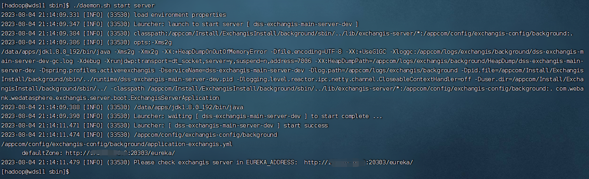
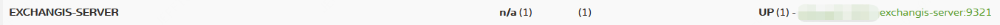

## 前言

Exchangis 的安装，主要分为以下四步：

1. Exchangis 依赖环境准备
2. Exchangis 安装部署
3. DSS ExchangisAppConn 安装部署
4. Linkis Sqoop 引擎安装部署
5. Linkis DataX 引擎安装部署

## 1. Exchangis 依赖环境准备

#### 1.1 基础软件安装

| 依赖的组件                                 | 是否必装 | 安装直通车 |
|---------------------------------------| ------ | --------------- |
| JDK (1.8.0_141)           | 必装  | [如何安装JDK](https://www.oracle.com/java/technologies/downloads/) |
| MySQL (5.5+)           | 必装 | [如何安装mysql](https://www.runoob.com/mysql/mysql-install.html) |
| Hadoop(3.3.4，Hadoop 其他版本需自行编译 Linkis) | 必装 | [Hadoop部署](https://www.apache.org/dyn/closer.cgi/hadoop/common/hadoop-3.3.4/hadoop-3.3.4.tar.gz) |
| Hive(2.3.3，Hive 其他版本需自行编译 Linkis)     | 必装 | [Hive快速安装](https://www.apache.org/dyn/closer.cgi/hive/) |
| SQOOP (1.4.6)                         | 必装 | [如何安装Sqoop](https://sqoop.apache.org/docs/1.4.6/SqoopUserGuide.html) |
| DSS1.1.2                              | 必装 | [如何安装DSS](https://github.com/WeBankFinTech/DataSphereStudio-Doc/tree/main/zh_CN/%E5%AE%89%E8%A3%85%E9%83%A8%E7%BD%B2) |
| Linkis1.4.0                           | 必装 | [如何安装Linkis](https://linkis.apache.org/zh-CN/docs/1.4.0/deployment/deploy-quick) |
| Nginx                                 | 必装 | [如何安装 Nginx](http://nginx.org/) |

底层依赖组件检查

注意：一定要使用最新版的dss1.1.2，及linkis1.4.0。

[linkis1.4.0代码地址](https://github.com/apache/incubator-linkis/tree/release-1.4.0)

[DSS1.1.2代码地址    ](https://github.com/WeBankFinTech/DataSphereStudio/tree/dev-1.1.2)

datasource启用

linkis的启动脚本中默认不会启动数据源相关的服务两个服务（ps-data-source-manager，ps-metadatamanager）， 如果想使用数据源服务，可以通过如下方式进行开启: 修改$LINKIS_CONF_DIR/linkis-env.sh中的 export ENABLE_METADATA_MANAGER=true值为true。 通过linkis-start-all.sh/linkis-stop-all.sh 进行服务启停时，会进行数据源服务的启动与停止。关于数据源更多详情可参考[数据源功能使用](https://linkis.apache.org/zh-CN/docs/1.4.0/user-guide/datasource-manual) 

#### 1.2 创建 Linux 用户

请保持 Exchangis 的部署用户与 Linkis 的部署用户一致，例如：部署用户是hadoop账号。

#### 1.3 在linkis中配置授权认证

###### 1）为exchangis加数据源认证的token

通过在linkis数据库中执行以下语句，为Exchangis分配专属token：

```
INSERT INTO `linkis_mg_gateway_auth_token`(`token_name`,`legal_users`,`legal_hosts`,`business_owner`,`create_time`,`update_time`,`elapse_day`,`update_by`) VALUES ('EXCHANGIS-AUTH','*','*','BDP',curdate(),curdate(),-1,'LINKIS');
```

###### 2）为exchangis加hive数据源的认证

通过在linkis数据库中执行以下sql语句，插入hive数据源环境配置，注意，执行前需要修改语句中的\$\{HIVE_METADATA_IP\}和\$\{HIVE_METADATA_PORT\}，例如\$\{HIVE_METADATA_IP\}=127.0.0.1，\$\{HIVE_METADATA_PORT\}=3306：

```
INSERT INTO `linkis_ps_dm_datasource_env` (`env_name`, `env_desc`, `datasource_type_id`, `parameter`, `create_time`, `create_user`, `modify_time`, `modify_user`) VALUES ('开发环境SIT', '开发环境SIT', 4, '{"uris":"thrift://${HIVE_METADATA_IP}:${HIVE_METADATA_PORT}", "hadoopConf":{"hive.metastore.execute.setugi":"true"}}',  now(), NULL,  now(), NULL);
INSERT INTO `linkis_ps_dm_datasource_env` (`env_name`, `env_desc`, `datasource_type_id`, `parameter`, `create_time`, `create_user`, `modify_time`, `modify_user`) VALUES ('开发环境UAT', '开发环境UAT', 4, '{"uris":"thrift://${HIVE_METADATA_IP}:${HIVE_METADATA_PORT}", "hadoopConf":{"hive.metastore.execute.setugi":"true"}}',  now(), NULL,  now(), NULL);
```

如果hive数据源在部署时设置了需要进行kerberos方式认证，则需要在linkis_ps_dm_datasource_env表的parameter字段指定一个参数keyTab，其值的获取方式可见：[在Linkis中设置并认证hive数据源](https://linkis.apache.org/zh-CN/docs/latest/auth/token)

#### 1.4 底层依赖组件检查

**请确保 DSS1.1.2 与 Linkis1.4.0 基本可用，可在 DSS 前端界面执行 HiveQL 脚本，可正常创建并执行 DSS 工作流。**


## 2. Exchangis 安装部署

### 2.1 安装包准备

#### 2.1.1下载二进制包

从 Exchangis 已发布的 release 中 [点击下载exchangis安装包](https://github.com/WeBankFinTech/Exchangis/releases/tag/release-1.1.2)，下载最新的安装包。

#### 2.1.2 编译打包

在项目的根目录下执行如下命令：

```shell script
  mvn clean install 
```

编译成功后将会在项目的 `assembly-package/target` 目录下生成安装包。

### 2.2 解压安装包

执行以下命令进行解压：

```shell script
  tar -zxvf wedatasphere-exchangis-{VERSION}.tar.gz
```

解压出来后的目录结构如下：

```html
|-- config：一键安装部署参数配置目录
|-- db：数据库表初始化 SQL 目录
|-- packages：Exchangis 安装包目录
	|-- exchangis-extds：数据源扩展库
	|-- lib：库
|-- sbin：脚本存放目录
```

### 2.3 修改配置参数

```shell script
  vim config/config.sh
```

```shell script
#LINKIS_GATEWAY服务地址IP，用于查找linkis-mg-gateway服务
LINKIS_GATEWAY_HOST={IP}

#LINKIS_GATEWAY服务地址端口，用于查找linkis-mg-gateway服务         
LINKIS_GATEWAY_PORT={PORT}    

#Exchangis服务端口
EXCHANGIS_PORT={PORT}

#Eureka服务URL
EUREKA_URL=http://{IP:PORT}/eureka/
```

### 2.4 修改数据库配置

```shell script
  vim config/db.sh
```

```shell script
# 设置数据库的连接信息
# 包括IP地址、端口、用户名、密码和数据库名称
MYSQL_HOST={IP}
MYSQL_PORT={PORT}
MYSQL_USERNAME={username}
MYSQL_PASSWORD={password}
DATABASE={dbName}
```

### 2.5 安装和启动

#### 2.5.1 执行一键安装脚本

在sbin目录下执行 `install.sh` 脚本，完成一键安装部署：

```shell script
./install.sh
```

#### 2.5.2 安装步骤

该脚本为交互式安装，开始执行install.sh脚本后，安装步骤依次分为以下几步：

1.	初始化数据库表

当出现该提醒时：Do you want to initalize database with sql: [${SQL_SOURCE_PATH}]?

输入 `y` 初始化数据库表，输入 `n` 跳过数据库表初始化步骤。

#### 2.5.3 修改配置文件路径和日志文件路径

在sbin目录下的`env.properties`文件，设置配置文件路径和日志文件路径

```yaml
EXCHANGIS_CONF_PATH="/appcom/config/exchangis-config/background"
EXCHANGIS_LOG_PATH="/appcom/logs/exchangis/background"
MODULE_DEFAULT_PREFIX="dss-exchangis-main-"
MODULE_DEFAULT_SUFFIX="-dev"
```

EXCHANGIS_CONF_PATH为配置文件路径，EXCHANGIS_LOG_PATH为日志文件路径，若为以上配置，则作如下操作：

```shell
cd {EXCHANGIS_DEPLOY_PATH}
cp -r config /appcom/config/exchangis-config/background
mkdir -p /appcom/logs/exchangis/background
```

则在服务启动时，将会使用对应路径下的配置文件，以及将日志写到对应的路径下

#### 2.5.4 启动服务

第一次启动，可以sbin目录下执行以下命令，启动 Exchangis Server：

```shell script
./daemon.sh start server
```

您也可以使用以下命令在sbin目录下完成 Exchangis Server 的重启：

```shell script
./daemon.sh restart server
```

执行完成启动脚本后，会出现以下提示，eureka地址也会在启动服务时在控制台打出：



### 2.6 查看服务是否启动成功

可以在Eureka界面查看服务启动成功情况，查看方法：

使用 http://${EUREKA_INSTALL_IP}:${EUREKA_INSTALL_PORT}, 建议在 Chrome 浏览器中打开，查看服务是否注册成功。

如下图所示：



### 2.7 前端安装部署

#### 2.7.1 获取前端安装包

Exchangis 已默认提供了编译好的前端安装包，可直接下载使用：[点击下载前端安装包](https://github.com/WeBankFinTech/Exchangis/releases/download/release-1.1.2/web-dist.zip)

您也可以自行编译 Exchangis 前端，在 Exchangis 根目录下执行如下命令：

```shell script
  cd web
  npm i
  npm run build
```

从 `web/` 路径获取编译好的 exchangis-ui.zip 前端包。

获取到的前端包，您可以放在服务器上的任意位置，这里建议您与后端安装地址目录保持一致，在同一目录下放置并解压。

#### 3.3.4 前端安装部署

1. 解压前端安装包

如您打算将 Exchangis 前端包部署到 `/appcom/Install/ExchangisInstall/exchangis-ui` 目录，请先将 `exchangis-ui.zip` 拷贝到该目录并执行解压，注意，**请在安装dss的机器上安装exchangis前端**：

```shell script
  # 请先将 Exchangis 前端包拷贝到 `/appcom/Install/ExchangisInstall` 目录
  cd /appcom/Install/ExchangisInstall
  unzip exchangis-ui.zip
```

执行如下命令：

```shell script
  vim /etc/nginx/conf.d/exchangis.conf
```

```
        server {
            listen       {PORT}; # 访问端口 如果该端口被占用，则需要修改
            server_name  localhost;
            #charset koi8-r;
            #access_log  /var/log/nginx/host.access.log  main;
            location / {
            root   /appcom/Install/ExchangisInstall/exchangis-ui; # Exchangis 前端部署目录
            autoindex on;
            }

            location /api {
            proxy_pass http://{IP}:{PORT};  # 后端Linkis的地址，需要修改
            proxy_set_header Host $host;
            proxy_set_header X-Real-IP $remote_addr;
            proxy_set_header x_real_ipP $remote_addr;
            proxy_set_header remote_addr $remote_addr;
            proxy_set_header X-Forwarded-For $proxy_add_x_forwarded_for;
            proxy_http_version 1.1;
            proxy_connect_timeout 4s;
            proxy_read_timeout 600s;
            proxy_send_timeout 12s;
            proxy_set_header Upgrade $http_upgrade;
            proxy_set_header Connection upgrade;
            }

            #error_page  404              /404.html;
            # redirect server error pages to the static page /50x.html
            #
            error_page   500 502 503 504  /50x.html;
            location = /50x.html {
            root   /usr/share/nginx/html;
            }
        }
```

#### 2.7.3 启动 nginx 及访问前端页面

配置完成之后，使用以下命令重新刷新 nginx 配置:

```shell script
  nginx -s reload
```

请通过 http://${EXCHANGIS_INSTALL_IP}:{EXCHANGIS_INSTALL_PORT}/#/projectManage 访问 Exchangis 前端页面，出现以下界面，说明exchangis安装前端成功，如果要真正试用exchangis，需要安装dss和linkis，通过dss进行免密登录，如下图所示：


## 3. DSS ExchangisAppConn 安装部署

如您想正常使用 Exchangis1.1.2 前端，还需安装 DSS ExchangisAppConn 插件，请参考: [ExchangisAppConn 插件安装文档](https://github.com/WeBankFinTech/Exchangis/blob/dev-1.1.2/docs/zh_CN/ch1/exchangis_appconn_deploy_cn.md)

## 4. Linkis Sqoop 引擎安装部署

如您想正常执行 Exchangis1.1.2 的 Sqoop作业，还需安装 Linkis Sqoop 引擎，请参考: [Linkis Sqoop 引擎插件安装文档](https://linkis.staged.apache.org/zh-CN/docs/1.4.0/engine_usage/sqoop)

## 5. Linkis DataX 引擎安装部署

如您想正常执行 Exchangis1.0.0 的 DataX作业，还需安装 Linkis DataX 引擎，请参考: [Linkis DataX 引擎插件安装文档](https://github.com/WeBankFinTech/Exchangis/blob/dev-1.1.2/docs/zh_CN/ch1/exchangis_datax_deploy_cn.md)

## 6. 如何登录使用 Exchangis

Exchangis更多使用说明，请参考用户使用手册[Exchangis 用户手册](https://github.com/WeBankFinTech/Exchangis/blob/dev-1.1.2/docs/zh_CN/ch1/exchangis_user_manual_cn.md)
