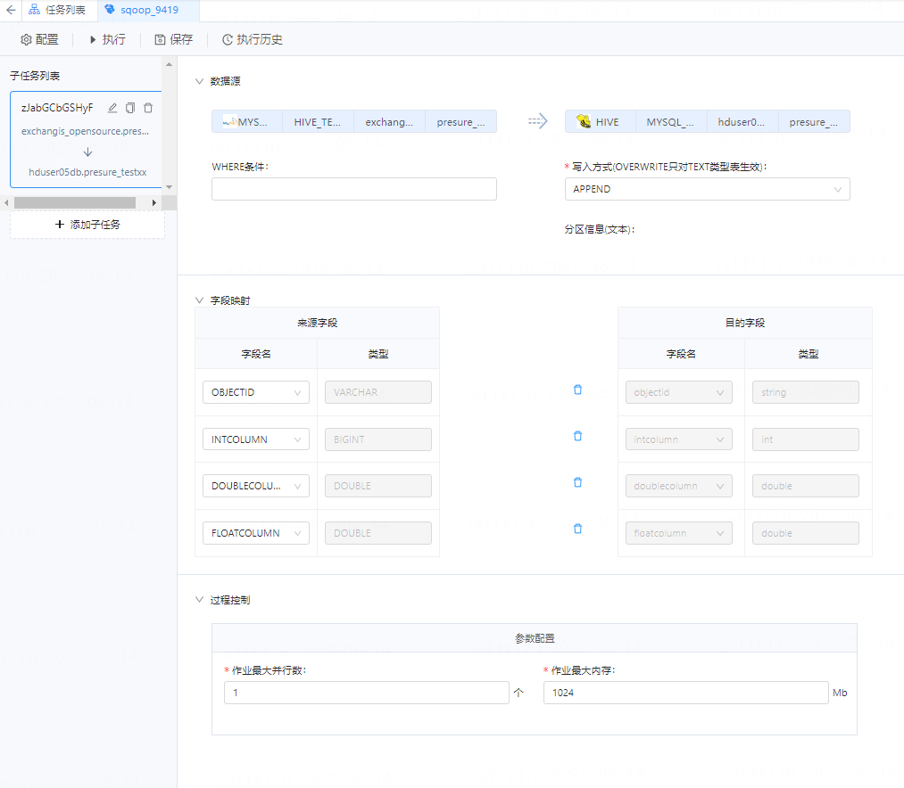
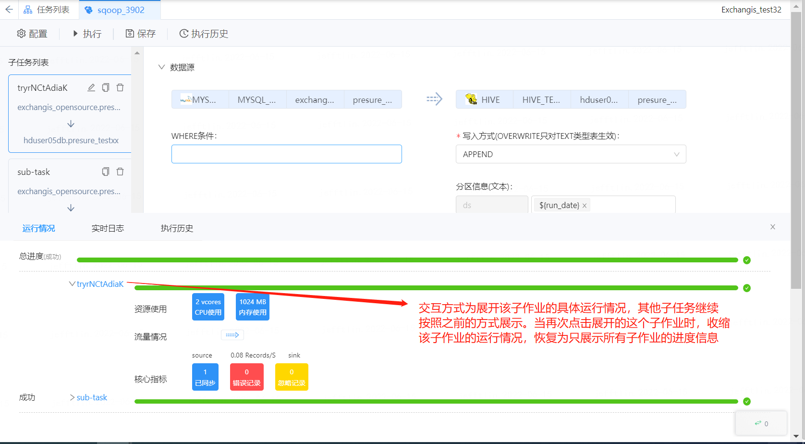
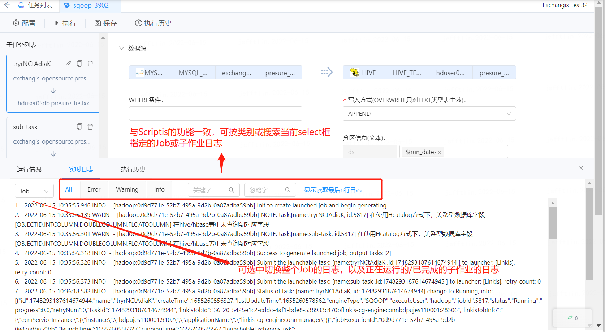

# Exchangis同步作业执行模块详细设计文档

## 一、总体流程图

 

图1-1 总体流程图
 

请注意：

1.   如果用户通过REST客户端直接提交一段希望被执行的同步任务JSON，则无需进行步骤二，直接将JSON提交给TaskGenerator即可。

2. 前端或REST客户端每次提交时，会产生一个jobExecutionId给前端，后续前端或REST客户端通过jobExecutionId获取同步作业Job的执行情况。

3. jobExecutionId最好是在用户提交过来时就产生且返回，即TaskGenerator应该是异步进行的。一般情况下，TaskGenerator的时间可能是几秒到几分钟（取决于subJob的个数），所以如果等TaskGenerator完成后才返回 jobExecutionId，则前端请求很可能超时。

4. 只所以前端或REST客户端每次提交都产生一个jobExecutionId，是为了支持同一个ExchangisJob的重复提交。所以JobServer原则上不会检查一个ExchangisJob只能同时有一个实例在执行，但是Web前端应该保证同一个浏览器同一时刻的同一个ExchangisJob只有一个在执行。

## 二、前后台交互

图2-1 前后台交互
 

### 1.  jobExecutionId的必要性

考虑REST客户端直接提交一段希望被执行的同步任务JSON的场景，以及为了支持同一个ExchangisJob的重复提交，所以每次提交时，产生一个jobExecutionId就非常有必要。

jobExecutionId是一个ExchangisJob的执行凭证，会存储到数据库之中，后续关于本次ExchangisJob执行的所有请求，都需带上jobExecutionId。

1. TaskGenerator异步的必要性

考虑到一种场景，即客户端提交了作业后，在Exchangis还没来得及返回jobExecutionId时客户端挂掉了，这种情况下，由于客户端的日志中没有打印jobExecutionId，提交用户以为作业没有提交成功，则有可能会存在数据错乱的问题。而且， TaskGenerator 处理一个ExchangisJob的时间可能很长（取决于subJob的个数），所以如果等TaskGenerator完成后才返回 jobExecutionId，则前端请求很可能超时。

所以应该在JobServer接收到作业执行请求后，就立马生成一个jobExecutionId，并在数据库中为该ExchangisJob生成一条执行记录，且将该执行状态置位Inited，只要数据库持久化成功，就异步生成TaskGenerator的任务，并立马返回jobExecutionId。

### 2.  JobServer的无状态性

这里讨论JobServer是否是无状态的，即前端拿到jobExecutionId之后，无论请求哪一个JobServer实例，都是能正常拿到想要的执行中数据。

由于JobServer的内存中没有存储特殊信息，且ExchangisJob执行状态、进度和Metrics信息都会存到数据库中，当前端请求发送过来时，只需去数据库拉取相关数据即可。

所以JobServer是无状态的。

### 3.  多租户功能

考虑到多租户能力，我们可以将JobGenerator和JobExecution进行拆分，即JobGenerator用于分布式接收前端/REST客户端提交过来的作业执行请求，JobGenerator生成任务集并存储到数据库中，这个微服务是可以所有租户共用的；而JobExecution则可以根据不同的租户进行划分，从而避免执行过程中彼此进行影响。

### 4.  高可用能力

JobExecution的TaskChooseRuler会去数据库中扫描所有的ExchangTask，如果一个ExchangisTask在超过一段时间后还没有状态更新，则会被新的JobServer进行接管。

如何接管？

简单式的接管就是所有其他存货的JobServer同时加载这个ExchangisTask到TaskScheduler，由于是更新进度、状态和Metrics信息，虽然多个同时更新，但是对任务并无影响。

复杂接管则需在ExchangisTask的数据库表中增加一个字段，用于标识正在执行该ExchangisJob的JobServer，这时触发多个JobServer抢夺该ExchangisTask的所有权，由于该方案较复杂，暂不考虑。

## 三、前端交互详解

### 1. 提交

在没有执行前，页面如下图所示：

由于执行接口（附上提交接口的链接）需带上jobId，实际提交执行之前，需先保存，再提交，且提交前需做基本检查，即如果没有一个子任务或作业保存失败，则不能提交执行。

图3-1 任务提交
 

点击执行之后，如下图所示：

需注意，这时会弹出作业信息台，默认展示运行情况，即总体进度和所有子任务的进度情况。

这里前端会用到两个接口，一是先使用【执行接口】，提交执行ExchangisJob，后台返回jobExecutionId；二是通过jobExecutionId调用【获取Job进度】接口，用于获取Job & 所有task的进度信息，用于展示如下页面的进度情况。

图3-2 任务执行
 

### 2. 子任务的运行情况

当用户点击正在运行/已完成的某个子作业时，这时前端触发请求后台的【获取Task Metrics信息】接口，通过jobExecutionId & taskId来获取task Metrics信息，展示如下页面的内容：

图3-3 子任务运行情况
 

主要展示资源使用情况、流量情况和核心指标。

图3-4 子任务资源使用情况
 

### 3. 实时日志

当用户点击如下图所示的右下角“日志”按钮时，信息台出现“实时日志”Tab，并默认展示Job的实时日志。当点击运行情况的“日志”按钮时，首先会默认展示整个作业的运行日志，这时前端默认调用【获取Job实时日志】的接口，通过jobExecutionId获取Job日志并进行展示，如下图：

图3-5 任务实时日志
 

只要用户不切到信息台的其他Tab，则前端会不断向后台轮询实时日志；

用户也可以通过select选择框选择查看某一个task的日志，这时触发请求【获取task实时日志】接口，通过jobExecutionId & taskId获取task日志并不断轮询最新日志。

如果用户切换了select选择框，之前的那个日志不再刷新。

这里需要注意，后台还提供了一个【获取本次Job执行的task列表】接口，是为了协助前端拿到所有的task列表，用于展示select选择框的内容，如果Job本身还在Inited或Scheduled状态，还未成功转为Running状态，这时是拉不到task列表的，所以当用户下拉select选择框时，应该提示用户“Job还在调度中，请在Job转为Running状态后再查看子任务的实时日志”。

运行完成后，如果状态为成功，则将Tab切回运行情况Tab页面；如果状态为失败，则基于【获取Job进度】接口所返回的信息，默认跳转并展示失败的subJob所在的task的日志，多个task失败时自动展示第一个失败的task的日志。

## 四、后台设计详解

### 1. 数据库表结构设计

图4-1 数据库表结构设计
 

### 2.  接口文档

详见：Exchangis作业执行模块接口文档

### 3.  核心模块 & 核心类设计

#### 3.1 实体Bean的UML类图如下：

 

图4-2 实体Bean的UML类图
 

请注意：其中所有以Entity结尾的非接口，都是需要存储到数据库之中，作为一张表而存在。

#### 3.2 TaskGenerator的UML类图结构如下：

图4-3 TaskGenerator的UML类图
 

TaskGenerator只负责将一个Job的JSON转换成可以提交给Linkis执行的任务集（即将Job下面的所有subJob翻译成一个ExchangisTask集），翻译完成后写入DB。

这里需要注意，TaskGenerator是异步执行的，我们会在Service层封装出JobGenerationSchedulerTask用于异步提交给TaskExecution去执行。

#### 3.3 TaskExecution体系的UML类图结构如下：

图4-4 TaskExecution体系的UML类图
 

1. TaskExecution主要由TaskConsumer、TaskManager、TaskScheduler和TaskSchedulerLoadBalancer组成。

2. TaskManager，主要用于管理该JobServer下所有处于Running状态的ExchangisTask；

3.   TaskConsumer则由多个功能不同的线程组组成，如NewTaskConsumer和ReceiveTaskConsumer等；其中NewTaskConsumer每次从数据库中fetch所有可被执行的处于Inited状态的ExchangisTask列表（可能包含多个Job的多个subJob所对应的ExchangisTask列表），按照TaskScheduler的实际负载情况分批次提交给TaskScheduler；提交之前，会先更新数据库里这个task的状态为Scheduled；而ReceiveTaskConsumer用于接管一个已在运行中，但是超过一定时间后还是没有更新状态和Metrics信息的ExchangisTask，将该ExchangisTask放入TaskManager之中，等待被StatusUpdateSchedulerTask和MetricsUpdateSchedulerTask更新状态。而TaskChooseRuler则是用于协助TaskConsumer过滤和选择所需要的ExchangisTask的规则器，如判断是否ExchangisTask可以接手、优先级策略等规则。

4.   TaskScheduler是一个线程池，用于调度各种类型的SchedulerTask；其中，SubmitSchedulerTask，用于异步将任务提交给Linkis去执行，并将Linkis返回的关键信息如Id、ECM信息等写入DB；StatusUpdateSchedulerTask和MetricsUpdateSchedulerTask是永远不会停止的常驻型轮询任务，会不断从TaskManager中拿到已经处于Running状态的SchedulerTask，不断定时向Linkis去请求状态和Metrics信息，并更新数据库。

5. TaskSchedulerLoadBalancer是一个负载器，用于实时检测TaskManager内的runningTask的轮询情况、TaskScheduler和服务器的负载情况，确定TaskScheduler最终实例化多少个StatusUpdateSchedulerTask和MetricsUpdateSchedulerTask去轮询所有处于Running状态的任务的状态和Metrics信息。

#### 3.4 TaskScheduler体系的UML类图如下：

图4-5 TaskScheduler体系的UML类图
 

TaskScheduler基于linkis-scheduler模块来实现。

#### 3.5 Listener体系的UML类图如下：

图4-6 Listener体系的UML类图
 

Listener体系是保证各信息能更新到数据库的核心，实现这些listener的实现类应该都是各个service类。

