# Exchangis1.0用户手册

## 一、产品简介

&emsp;&emsp;本文是Exchangis1.0的快速入门文档，涵盖了Exchangis1.0的基本使用流程。Exchangis是一款轻量级的数据交换服务平台，支持不同类型数据源之间的数据同步。平台将数据交换流程进行拆分，抽象出数据源，数据交换任务，任务调度等概念，达到可视化管理数据同步流程的目的。而在实际数据传输过程中可集成多个传输组件特性，做到功能横向扩展。

## 二、登录Exchangis1.0

&emsp;&emsp;Exchangis1.0目前作为DSS**数据交换组件**的一部分，通过登录DSS的方式在组件列表中免密进入。所以，在使用Exchangis1.0之前，请对DSS，Exchangis1.0，Linkis等相关组件进行基本部署，保证组件功能可用，本文不进行赘述，详情见[exchangis部署文档](https://github.com/WeBankFinTech/Exchangis/blob/dev-1.0.0/docs/zh_CN/ch1/exchangis_deploy_cn.md)和[exchangis-appconn部署文档](https://github.com/WeBankFinTech/Exchangis/blob/dev-1.0.0/docs/zh_CN/ch1/exchangis_appconn_deploy_cn.md)

### 1、登录DSS

&emsp;&emsp;系统默认通过Linkis的Linux部署用户登录DSS，如使用hadoop用户部署Linkis和DSS，可以直接通过账号密码：hadoop/hadoop登录。 首先根据DSS的前端部署地址登录网页，接着输入账号密码：hadoop/hadoop进入DSS

### 2、进入Exchangis

&emsp;&emsp;Exchangis通过DSS来进入，在DSS页面中一词点击：**首页->DSS应用组件->数据交换->进入Exchangis**

图2-1 Exchangis1.0入口
 

## 三、数据源管理

&emsp;&emsp;该模块可以对数据源进行配置和管理，为进行数据同步作业的起始步骤，目前Exchangis1.0支持对mysql和hive直接数据的互相导入。
数据源主要功能如下：

1.	创建，编辑，删除数据源；
2.	根据类型和名称搜索数据源，支持对数据源快速定位；
3.	数据源连接测试操作；
4.	历史数据源版本发布及记录。

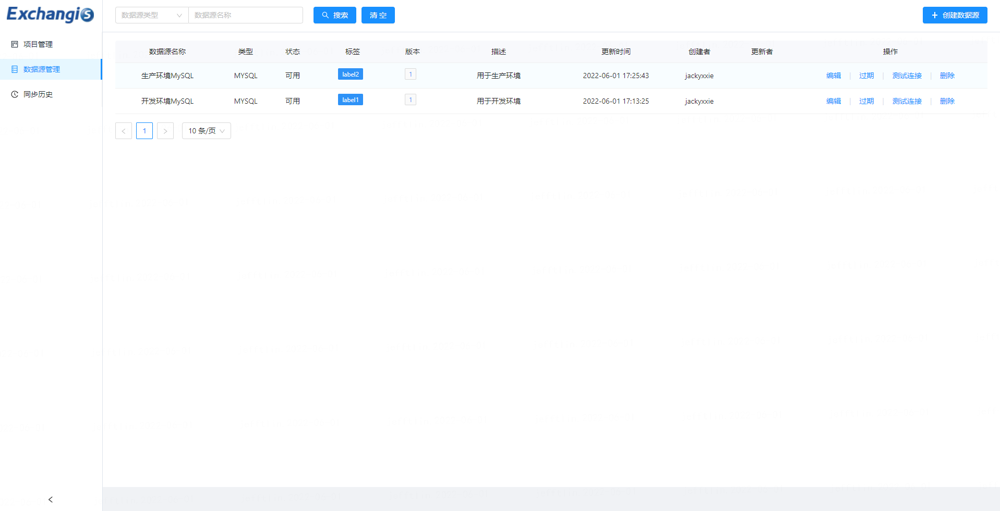

图3-1 数据源管理列表
 

### 1、创建数据源

&emsp;&emsp;点击**创建数据源**，选择自己想要创建的数据源，当前支持MySQL和Hive两种数据源的创建。

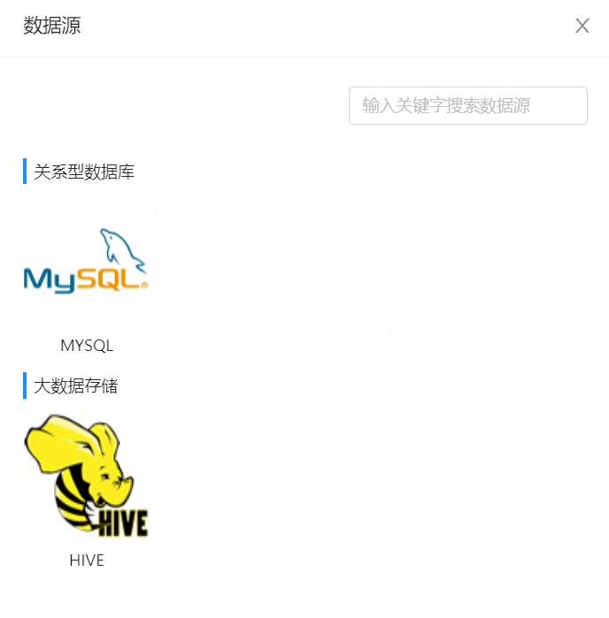

图3-2 数据源类型
 

&emsp;&emsp;选择创建MySQL数据源，填写配置参数，其中，带星号的为必填项，务必保证连接MySQL数据库的Host，端口号，用户名和密码连接正确。**连接参数**为Json格式，用于设置MySQL的配置信息，填写完能够进行**测试连接**。

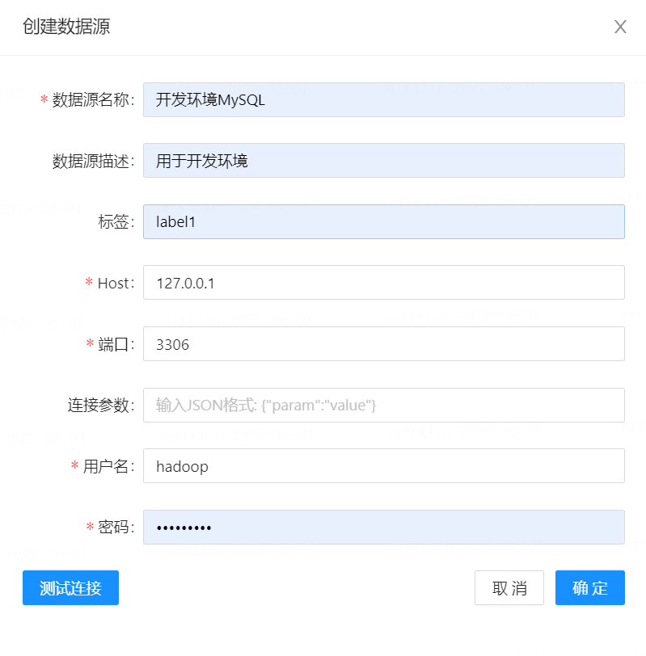

图3-3 MySQL数据源配置
 

&emsp;&emsp;对于Hive数据源的配置，与MySQL不太相同，暂时不提供用户自行在界面进行集群参数配置的功能，对于集群环境，由后端统一配置完成，用户只需要选择需要的集群环境即可，点击确定即可保存。

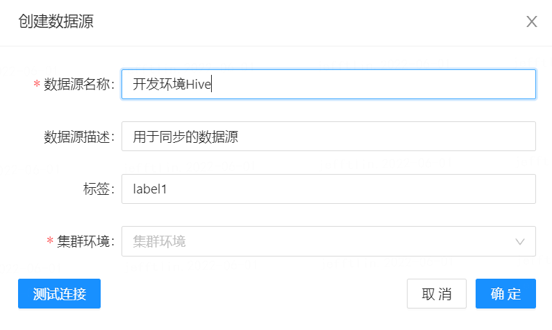

图3-4 Hive数据源配置
 

### 2、数据源功能

&emsp;&emsp;数据源管理模块提供对配置数据源版本的**发布**功能，只有经过发布的数据源才能在配置导数任务的时候被使用，否则会提示不可用，只要再次编辑的数据源就会被视为一个新的版本，最新的版本在第一行。在版本列表中可以**查看**所有历史数据源版本的配置，您可在随时需要回滚时进行参考。

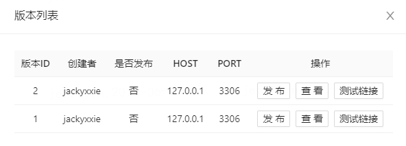

图3-5 数据源发布功能
 

&emsp;&emsp;数据源管理的**过期**功能，用于提示此数据源已经逐渐要被替换，请及时更换使用该数据源的任务配置，避免直接删除数据源造成所配置的执行任务失效。
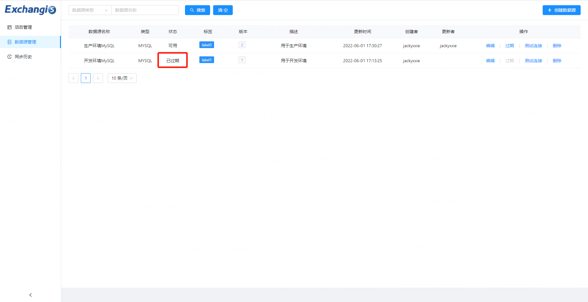

图3-6 数据源过期功能
 

## 四、项目管理

### 1、项目列表

&emsp;&emsp;该模块可以创建项目，在实际的导数任务中，一个项目下可以有多个导数任务，不同的项目之间互不影响，对于普通用户而言，可以操作的只有自己创建的项目。
在项目管理首页，可以对项目进行管理，包括**创建**，**修改**和**删除**以及**查询搜索**，修改和删除只能对在Exchangis中创建的项目操作。

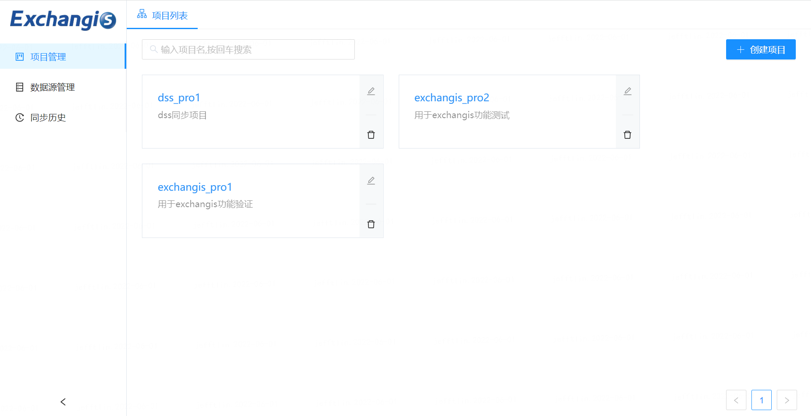

图4-1 项目列表
 

### 2、任务列表

进入项目，可以看到该项目下的任务列表。

#### 1）任务管理

&emsp;&emsp;任务列表中可以对创建的Job数据同步任务进行管理，与项目类似，包括**创建**，**修改**、**删除**和**搜索**。

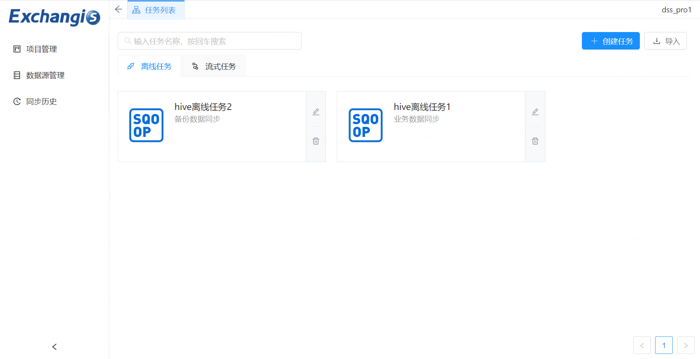

图4-2 任务列表
 

&emsp;&emsp;点击**创建任务**，能够选择任务类型和执行引擎，**目前仅支持离线任务和SQOOP执行引擎**，未来将会支持流式任务和DataX引擎等。

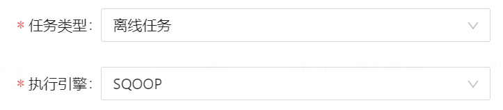

图4-3 任务类型和引擎配置

#### 2）子任务管理

&emsp;&emsp;在任务中点击**添加子任务**，可以添加多个子任务，支持对子任务的**修改、复制和删除**

&emsp;&emsp;同时也支持**任务支持复制**，复制的子任务包含其原子任务配置的所有信息。

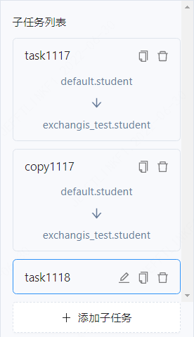

图4-4 子任务管理

#### 3）数据同步任务配置和执行

&emsp;&emsp;进行该步骤前，需要预先在**数据源管理模块**添加好数据源以供选择，并进行**发布**，当前Exchangis版本仅支持**MySQL数据源和Hive数据源**。

&emsp;&emsp;数据同步任务配置和执行是Exchangis1.0.0的核心功能，基本配置数据同步流程为：**添加子任务 -> 选择Source数据源和Sink数据源 -> 字段映射配置 -> 过程控制 -> 任务配置 -> 保存 -> 执行**。

任务执行主要功能包括：
1.	子任务卡片的添加，复制和删除；
2.	实现对两种不同类型数据源之间数据的导入导出；
3.	来源数据源和目的地数据源的库表选择；
4.	数据源字段映射；
5.	作业最大并发数和作业最大内存配置；
6.	数据同步任务执行情况查看；
7.	每个主任务和各个子任务的日志查看；
8.	任务执行历史状态查看；
9.	执行任务kill操作。

##### 数据源选择和配置

&emsp;&emsp;对于新创建的数据同步子任务，要进行数据源库表的选择，选择的数据源为在**数据源模块**中已发布的数据源。数据源选择支持搜索，搜索方式为先搜索库，再搜索表。

&emsp;&emsp;MySQL为目的地数据源时，支持**插入**和**更新**两种写入方式；为源数据源时，支持**WHERE条件语句查询**。

&emsp;&emsp;Hive为目的地数据源时，支持分区信息配置，写入方式为**追加数据**和**覆盖**两种；为源数据源时，支持**分区信息配置**。

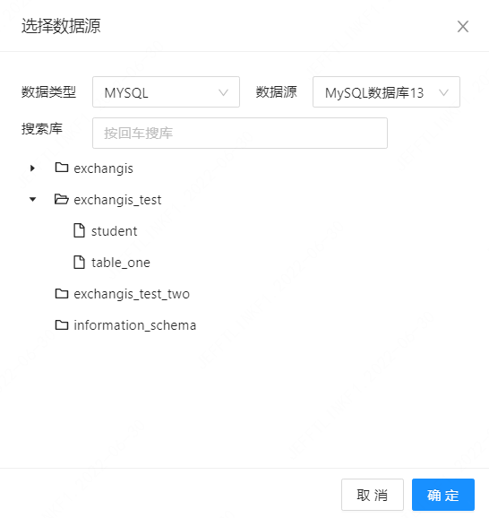

图4-5 选择数据源
 

 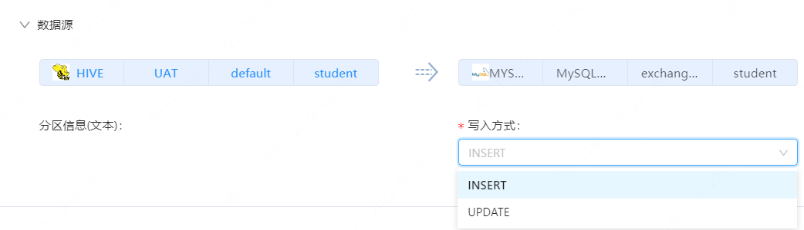

图4-6 写入方式配置
 

##### 数据源字段映射

&emsp;&emsp;当配置完成数据源库表信息时，Exchangis1.0.0会自动进行Source数据源和Sink数据源的字段映射，并且可以自行选择想要映射的字段，也可以用来检查我们的字段是否匹配；当Hive为Sink数据源时，其映射字段不可修改。

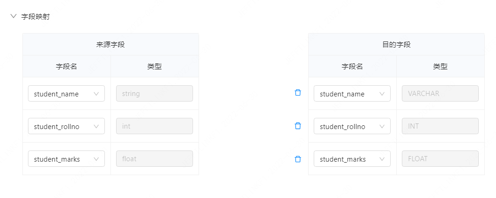

图4-7 字段映射
 

##### 过程控制

&emsp;&emsp;任务执行提供**作业最大并行数**配置（默认为1个），以及**作业最大内存**配置（默认为1024Mb），可根据实际需要进行更改。

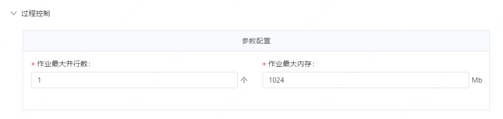

图4-8 过程控制
 

#### 4）作业执行

&emsp;&emsp;Exchangis1.0支持多个子任务同时执行，任务配置完成后，点击执行，即开始数据同步任务，界面下方会弹出工作台，工作台主要包含三个部分功能：**运行情况、实时日志和执行历史**。

&emsp;&emsp;**运行情况**能够查看当前数据同步任务整体进度，包含task成功和失败的数量等，以及点击task的名字，能够展示每个task的各项运行指标信息。

&emsp;&emsp;**实时日志**主要展示的内容包含两大类，一是整个导数job的日志，能够输出每个task的状态日志，例如task是否被调度，是否运行中等；二是每个task的日志，输出的是各自相应的导数日志。在实时日志中能够根据关键字和忽略字进行日志筛选，并别提供获取最后n行日志功能；还可以对Error、Warning和Info不同类型的日志进行筛选展示，只需点击相应的按钮即可。

&emsp;&emsp;**执行历史**能够展示该导数任务的历史执行信息，对历史执行过程提供初步的概览，如果想进一步查看详细历史信息，点击任务名称，即可跳转到同步历史界面进行查看。

&emsp;&emsp;数据同步任务执行需指定执行用户，默认为登录用户，具体情况需根据实际数据源的配置去调整。

## 五、同步历史

&emsp;&emsp;该模块可以查看到历史执行的所有数据同步任务，每个用户只能查看自己创建的任务，不同用户之间互相隔离。

主要功能如下：
1.	根据查询条件查找所需的历史任务信息；
2.	对于非终态的任务，提供终止任务的功能，能够kill掉非终态的任务；
3.	查看每个任务的运行情况和实时日志；
4.	查看每个同步任务的更细节配置信息和更新时间等。

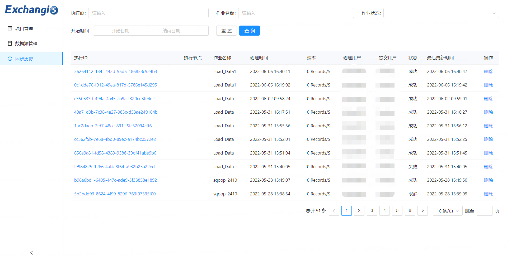

图5-1 同步历史界面
 

## 六、Exchangis Appconn使用

&emsp;&emsp;目前，Exchangis1.0支持以Appconn形式与DSS对接，**在DSS端**，能够通过DSS的**应用开发->项目列表**，以工作流编排的模式创建数据交换**sqoop工作流节点**，在这里，能够进行数据同步任务的配置和执行。在DSS创建的Exchangis项目和数据交换任务，会同步在Exchangis中创建。

Exchangis Appconn主要支持以下功能：

1.	**项目操作**是对DSS项目的创建，删除，修改操作会同步影响Exchangis端的项目；
2.	**工作流节点基本操作**是DSS编排器中对sqoop工作流节点创建，删除，修改操作会同步到Exchangis端的任务；
3.	**工作流导数操作**支持sqoop工作流节点配置执行数据同步任务；
4.	**工作流发布操作**支持sqoop工作流节点发布至WTSS进行任务调度。

### 1、项目操作

&emsp;&emsp;该模块能够对DSS项目进行创建、修改和删除，在DSS端的操作会同步到Exchangis端，这里以在DSS创建的项目为例，在exchangis appconn操作的流程为：**点击创建项目->填写项目信息->点击确认->进入Exchangis端->点击项目管理**，即可查看到同步创建的项目，如下图所示：

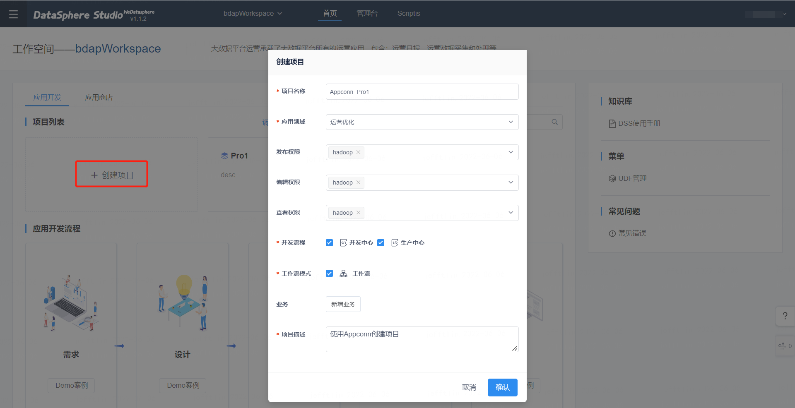

图6-1 项目操作
 

创建完成后，会在Exchangis端看到同步过来的项目

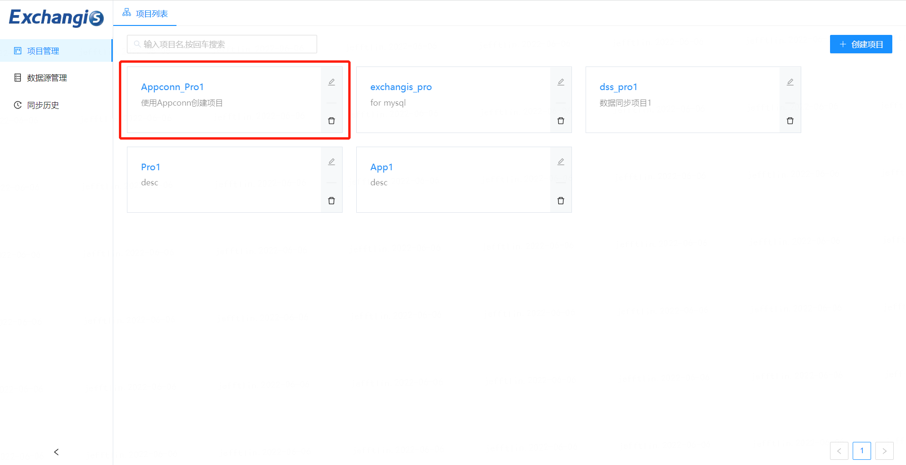

图6-2 项目同步到Exchangis
 

### 2、工作流节点基本操作

&emsp;工作流节点能够进行创建、修改、删除和进行依赖选择，可以进行节点之间的关联，在DSS端的操作会同步到Exchangis端。这里以对sqoop工作流节点的创建操作为例，在exchangis appconn对项目的操作流程为：**创建一条工作流->从左侧插件栏拖动sqoop节点至右侧画布->点击确认创建sqoop节点任务->进入exchangis端查看同步创建的任务**，如下图所示，对sqoop节点任务的删除和修改同理。

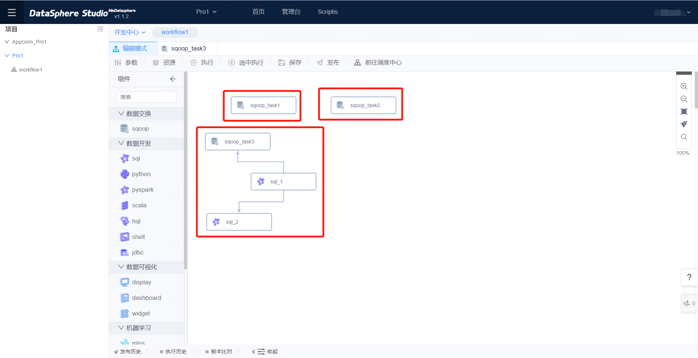

图6-3 Sqoop节点功能
 

可以看到导数任务也同步到Exchangis中了

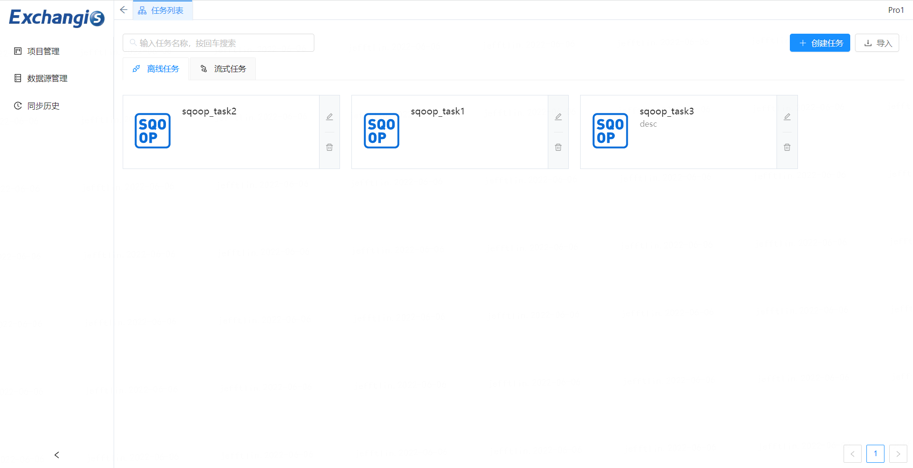

图6-4 Sqoop节点同步到Exchangis
 

### 3、工作流导数操作

&emsp;&emsp;双击Sqoop节点进行工作流节点进行操作，支持sqoop工作流节点配置与执行数据同步任务。以工作流节点形式进行导数任务是Exchangis Appconn的核心功能，**每一个sqoop节点代表一个数据同步任务**，具体操作流程如下：**双击sqoop节点->弹出任务配置界面->配置任务信息->执行任务**，如下图所示：

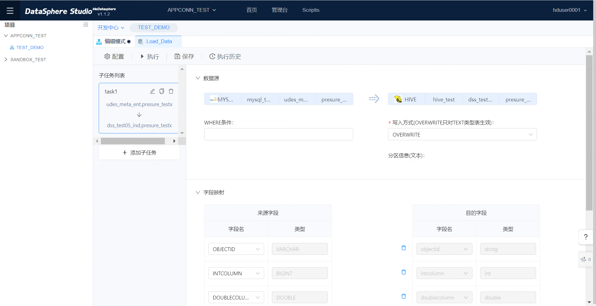

图6-5 双击sqoop工作流节点进入配置界面
 

图6-6 配置工作流节点信息
 

&emsp;&emsp;这里有两种执行方式，一种是在弹出的任务配置界面点击执行按钮进行执行；另一种是点击DSS编排器的**执行按钮**或者是**选中执行按钮**进行执行，**点击执行**会对该工作流中的所有节点执行，**点击选中执行**仅会执行选中的工作流节点，不会执行全部节点。

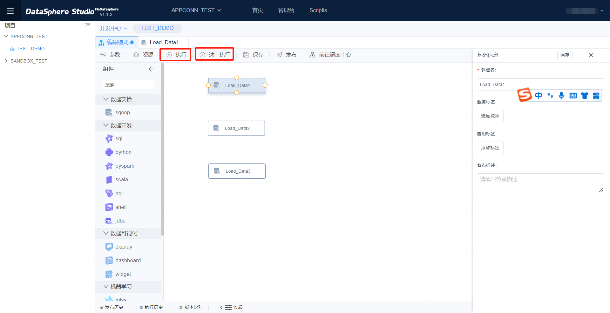

图6-7 执行任务
 

注：在DSS的sqoop节点中执行的数据同步任务，均可在Exchangis端查看相关信息。

### 4、工作流发布操作

&emsp;&emsp;工作流任务的**发布**功能，支持sqoop工作流节点发布至WTSS进行任务调度。在**开发中心**创建和配置的数据交换任务信息，通过发布，发布到WTSS，能够在WTSS中进行任务调度。

### 5、生产中心

&emsp;&emsp;点击命名空间的下拉框，切换到**生产中心**，可以看到所有项目的工作流的日志，可以查看每个工作流调度的状态

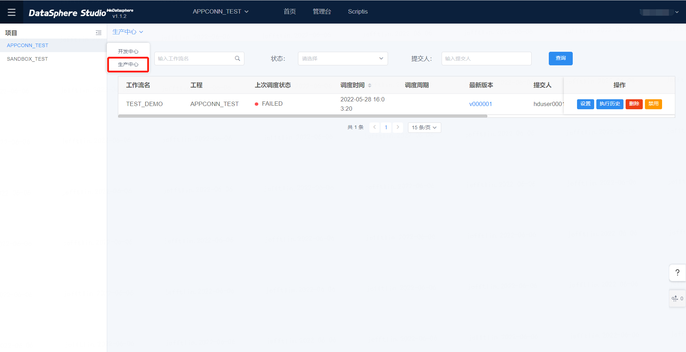

图6-8 生产中心
 

