- [产品简介](#产品简介)
- [使用接入](#使用接入)
   - [界面接入](#界面接入)
     - [主要界面介绍](#主要界面介绍)
        - [1.数据源管理－连接模版](#1.数据源管理-数据源)
        - [2.数据源管理-模板管理](#2.数据源管理-模板管理)
        - [3.任务配置](#3.任务配置)
        - [4.任务作业](#4.任务作业)
        - [5.权限组管理](#5.权限组管理)
     - [数据源模块](#数据源模块)
        - [1.创建数据源模板](#1.创建数据源模板)
        - [2.创建数据源](#2.创建数据源)
     - [任务配置模块](#任务配置模块)
        - [1.创建项目/权限组](#1.创建项目/权限组)
        - [2.配置数据交换任务](#2.配置数据交换任务)
        - [3.配置后置处理器](#3.配置后置处理器)
     - [任务作业模块](#任务作业模块)
        - [1.查看作业日志](#1.查看作业日志)
     - [系统管理模块](#系统管理模块)
        - [1.应用用户管理](#1.应用用户管理)
        - [2.执行(代理)用户管理](#2.执行(代理)用户管理)
        - [3.执行节点管理](#3.执行节点管理)
   - [脚本接入（未开源）](#脚本接入（未开源）)

### 产品简介
Exchangis是一款轻量级的数据交换服务平台，支持结构化、半结构化以及无结构化的存储系统之间的数据同步。平台将数据交换流程进行拆分，抽象出数据源，交换任务，交换作业等概念，达到可视化管理数据同步流程的目的。而在实际数据传输过程中可集成多个传输组件特性，做到功能横向扩展。

### 使用接入
### 界面接入
#### 主要界面介绍
##### 1.数据源管理-数据源
分类列举了用户创建的所有数据源，提供常用的搜索，编辑，删除方法，在点击 `编辑` 出现的弹窗中可以对数据源进行 `连接性测试` 和 `对外权限设置`。

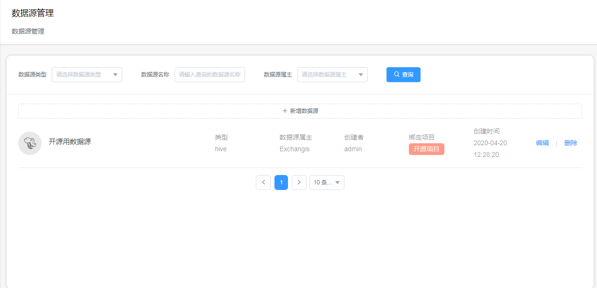

##### 2.数据源管理-模板管理
管理数据源的连接信息，将这些信息生成模板。例如IP地址，端口，集群配置参数，认证方式等信息，根据不同数据源类型和环境分开存储成模板，创建数据源时可以复用这些已有的连接模板。

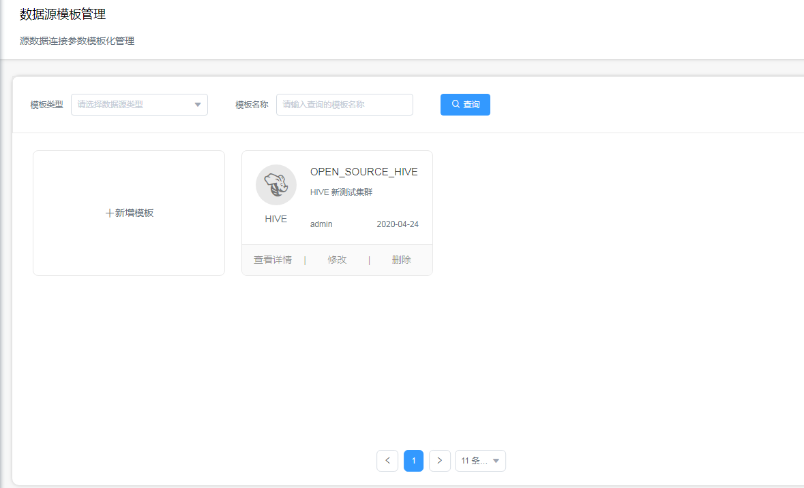

##### 3.任务配置
以项目为集合，管理用户配置的任务，用户可以组合现有的数据源创建交换任务，创建的任务将挂载到对应的项目下。同时还提供任务 `定时执行` 和 `历史数据重跑` 等功能。

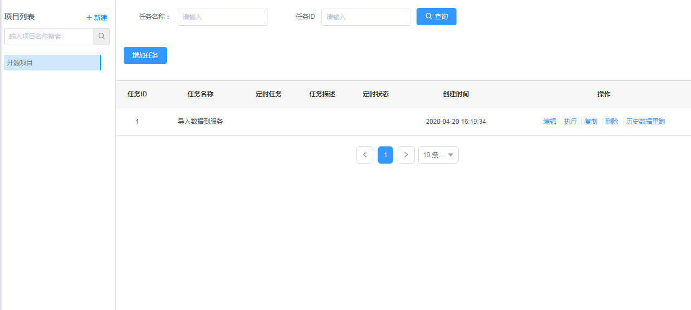

##### 4.任务作业
列举了用户相关任务下所有的执行作业，包括作业调用时间、完成时间、执行参数、执行节点以及完成状态，可以点击详细日志查看具体的执行细节。

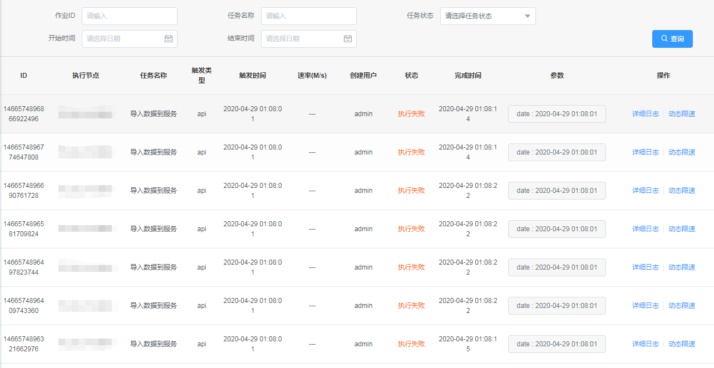

##### 5.权限组管理
默认用户创建一个项目时自动生成对应的一个权限组，用户可以通过增删成员的方式管理自己创建的项目权限组，同一权限组内的用户可以做到共享数据源。

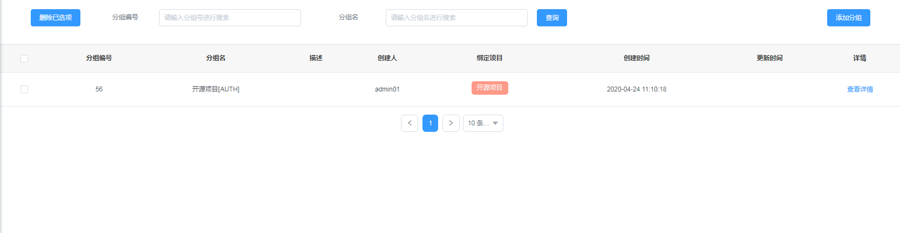


#### 数据源模块
#### 1.创建数据源模板
数据源模板包含各种形式的连接参数，持有模板可以快速创建数据源。进入`数据源管理-模板管理`界面，点击`+新建模板`，选择要创建的模板类型：

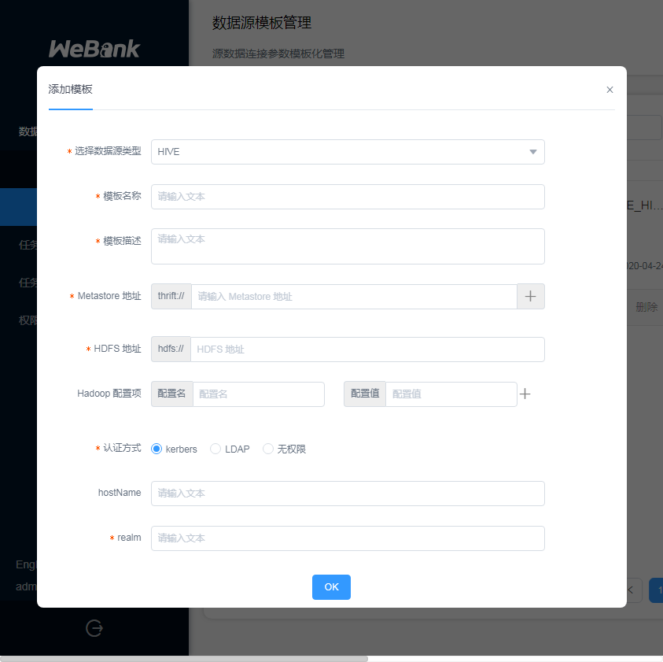

- 模板上一般可以选择认证方式，使用不同认证方式的模板创建数据源时，要求输入的认证信息不一样；  
- 普通用户可以编辑自己创建的模板，可以浏览管理员创建的模板，但不可以编辑，暂时不同用户之间不能共享模板。  
各种类型模板的填写样例如下:
##### 1.1 HIVE、HDFS连接模板
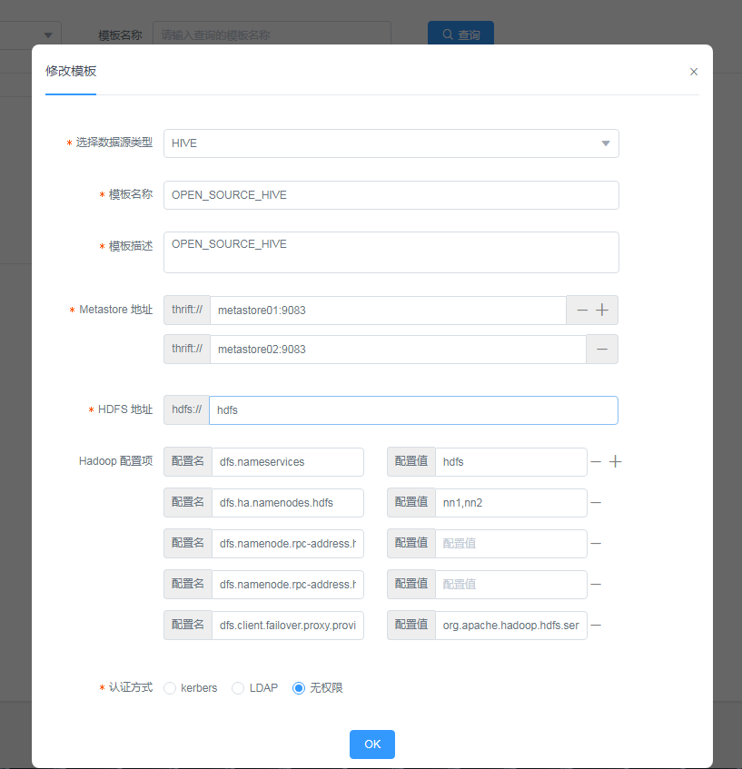

HIVE连接模板的必填项目：
```
Metastore地址， HiveMetastore地址，格式形如: thrift://path。
HDFS地址，格式形如: hdfs://path。
Hadoop配置项，包括namenode的地址,rpc端口等Hadoop客户端连接配置。
认证方式，有kerberos、LDAP和无权限三个选项，kerberos中realm为必填项
```
HDFS连接模板的内容和HIVE模板相似

##### 1.2 SFTP连接模版
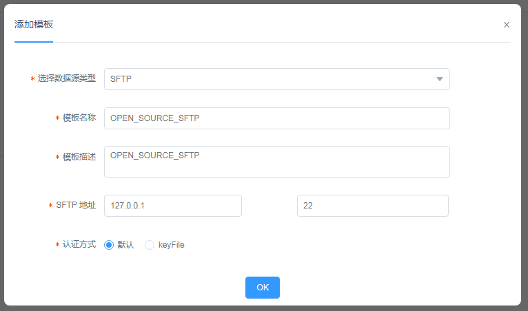

SFTP连接模版的必填项目：
```
SFTP HOST地址
SFTP PORT端口号
认证方式，默认为用户密码认证，keyfile为密钥文件验证
```

##### 1.3 ElasticSearch连接模版
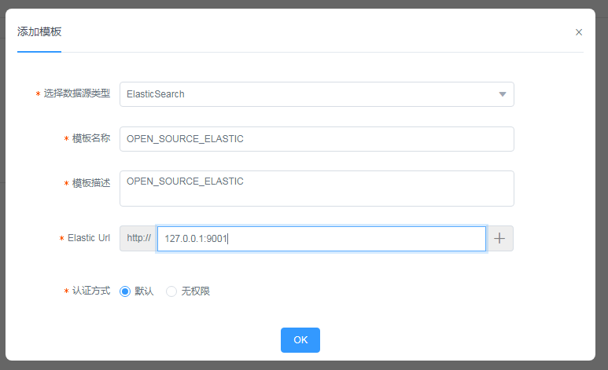

ElasticSearch连接模版的必填项目：
```
Elastic Url （ElasticSerach连接地址），可以填写多个
认证方式，默认为Basic Authentication
```

##### 1.4 MySQL连接模版
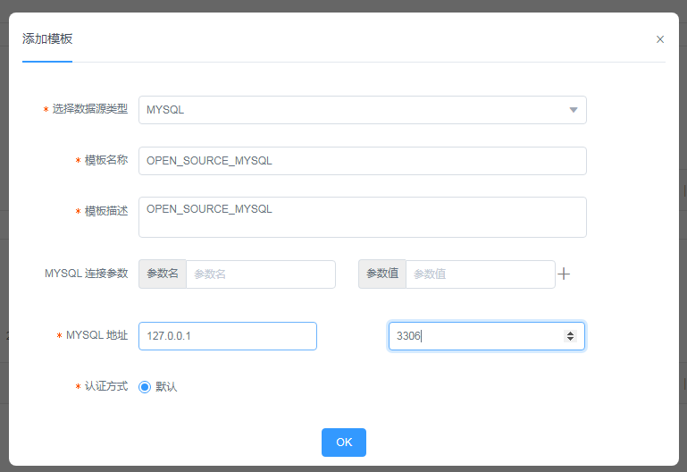

TDSQL连接模版的必填项目：
```
MySQL HST地址
MySQL PORT端口号
MySQL的连接参数，例如：useUnicode, characterEncoding, allowMultiQuery
```

#### 2.创建数据源
点击 `数据源管理界面` 上方的 `新增数据源`，选择对应的数据源类型，目前支持的类型有`HIVE`，`HDFS`, `SFTP`，`ElasticSearch`和`MySQL`,
选择后出现弹窗，开始新建数据源。其中必须要填写的项目有 `数据源名称` 和 `数据源属主`，以及 `连接模板`:

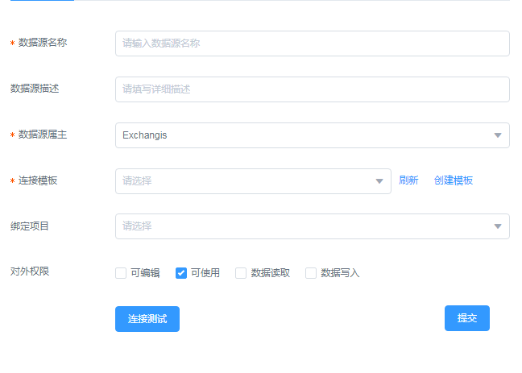

- 模板这里可以直接点击`创建模板`打开新标签页去创建对应的连接模板，创建完成后再点击`刷新`按钮加载新模板。  
- 数据源与项目存在绑定关系，一个数据源只能绑定一个项目，项目的成员可以浏览项目下绑定的所有数据源,
同时数据源创建者可以指定其对外权限，设置项目组其他成员对该数据源的`编辑`,`使用`,`读取`以及`写入`权限。  
- 最后填写完必要信息后，点击`连接测试`,检验数据源的可用性。

#### 任务配置模块
#### 1.创建项目/权限组
项目是`Exchangis`划分数据权限的基础，数据交换任务都挂载在项目上，数据源、用户也和项目有绑定关联关系，点击`任务配置`界面左侧的`+ 新建`可快速创建。
#### 2.配置数据交换任务
选中对应要添加任务的项目后，点击 `增加任务` 按钮，弹出任务配置窗口，选择要使用的传输引擎。  
目前Exchangis底层完全集成DataX，部分支持SQOOP，选择引擎要注意以下几点：
- 是否已经安装了引擎依赖的环境，DataX默认使用服务的JAVA环境，SQOOP则依赖了Hive和HDFS环境.
- 选用SQOOP引擎执行任务，由于依赖的是具体执行机器的环境，任务配置的Hive/HDFS数据源相关的参数信息会被具体环境的覆盖，数据源的认证信息也会失效。  

选择成功后，开始如下步骤的操作：
##### 2.1 选择数据来源和数据目的
数据交换任务的主要工作是在不同数据源之间传输数据，所以需要用户选择不同数据源和配置其具体的数据信息，数据信息就比如HIVE数据源的 `库`、`表`以及`表分区`，如下图：

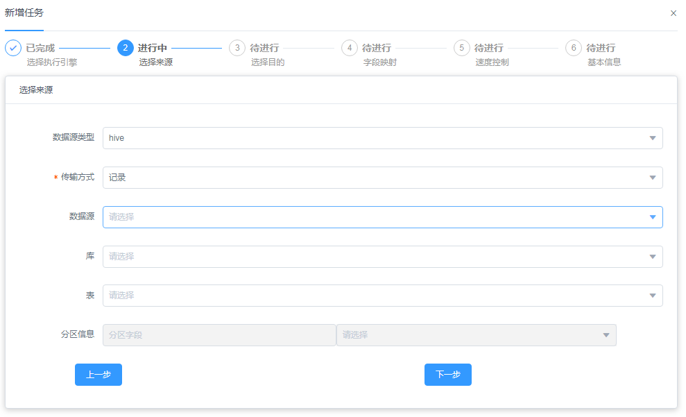

此外除了数据源管理界面里面创建的数据源外，用户在配置交换任务的时候还可以选择一种`local_fs`数据源，代表执行任务的机器节点的本地文件系统（Linux）:

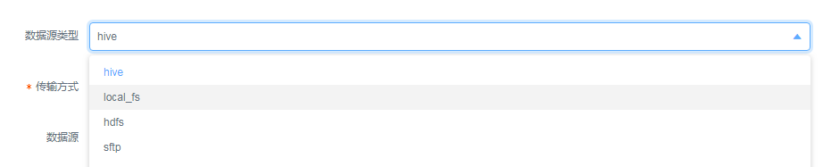

在最开始选择数据来源的时候，对于文件系统类的数据源可以选择不同的数据交换方式，有两种方式`二进制`和 `记录`：

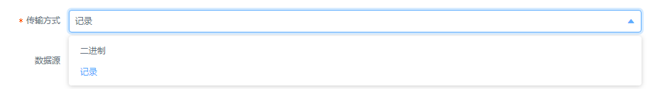

`二进制`方式下数据直接以流的形式传输，`记录`方式下数据将被解码并切割成多个记录实体来传递，适用于结构化数据库。

##### 2.2 配置时间占位符
在配置交换任务时候，用户可以在一些配置项例如路径或者分区值里面加入时间占位符，在任务执行的时候，会用任务绑定的时间参数（默认是**任务触发时间**）去替换这些占位符


支持的时间占位符有常见的：`yyyyMMdd`, `yyyy-MM-dd`，其他的具体含义见下表：

| 占位符 | 含义 | 例子 |
| :------ | :------: | :-----: |
| run_date | 设置为当前时间的前一天，格式为yyyyMMdd | 20200129 |
| run_date_std | 设置为当前时间的前一天，格式为yyy-MM-dd | 2020-01-29 |
| run_month_begin | 设置为当前时间所在月的第一天，格式为yyyyMMdd| 20200101|
| run_month_begin_std | 设置为当前时间所在月的第一天，格式为yyyy-MM-dd | 2020-01-01|
| run_month_end | 设置为当前时间所在月的最后一天，格式为yyyyMMdd | 20200131|
| run_month_end_std| 设置为当前时间所在月的最后一天，格式为yyyy-MM-dd | 20200131|


##### 2.3 字段映射
在对记录类型的数据进行传输的情况下，用户可以组合源表字段和目标表字段的对应关系，校验源表字段的值是否符合要求，对源表的字段的值进行转换：

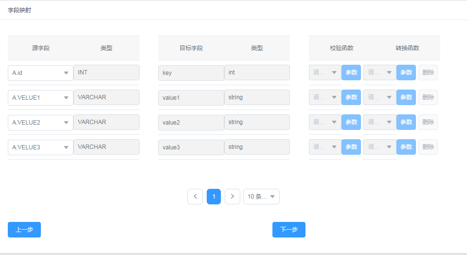

##### 2.4 速度控制
速度控制控制的是任务每秒全局传输数据的最大值，同时从字节和记录两个纬度进行限制；在速度控制选项卡下还可以控制并行数和最大使用内存数。

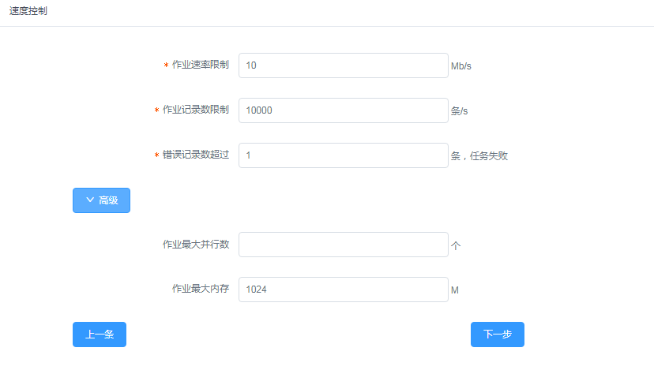

##### 2.5 基本信息
交换任务的基本信息应包括如下几点：
```
任务名称、任务描述
提醒人：任务失败以及超时的时候提醒的关系人，多个关系人逗号分隔 【默认告警信息打在后台日志中】
定时：设置任务定时的corn表达式
执行用户：设定的实际执行任务的系统（Linux）用户 【默认拥有同名的执行用户，其他需要管理员绑定授权】
执行节点：设定的实际执行任务的服务节点列表 【公用默认服务节点，其他需要管理员绑定授权】
超时时间：任务超时时间，单位秒
同步方式：全量同步、增量同步，默认为全量同步，增量方式目前只支持对文件类数据源
```
需要关注的点：
```
执行用户相当于代理用户，作用是限定权限，在任务执行的过程中，会用执行用户去启新进程和申请资源；  
而对于数据源连接，如果数据源有认证信息，则以数据源认证信息为主，如果没有，权限则会自动落到执行用户上（SQOOP引擎下HIVE/HDFS权限都落在执行用户上）;
```
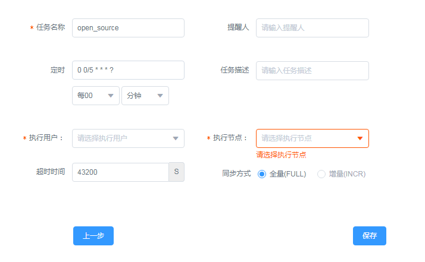

##### 3.配置后置处理器
Exchangis支持内嵌基础的处理代码，目前界面仅对ElasticSearch相关任务提供入口。当数据交换任务的目的端为ElasticSearch的时候，可以选择使用后置处理器，后置处理器允许用户以编写代码的方式对要写入的记录数据做更加定制化的处理操作：

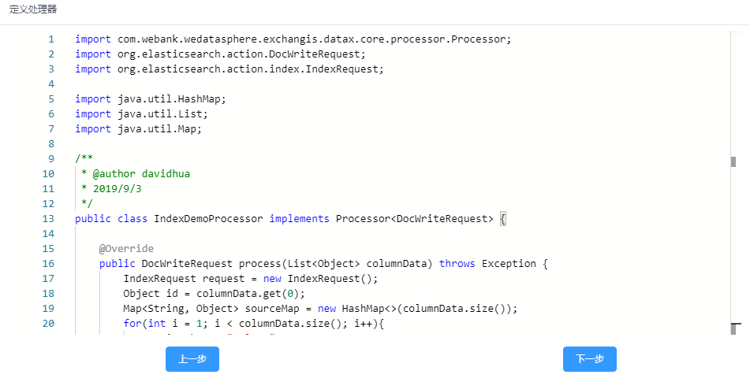

在后置处理器代码中，只可以读取作业进程工作目录下的文件，写入操作以及网络连接将被拦截禁止

#### 任务作业模块
##### 1.查看作业日志
在任务配置页面创建执行任务后，可以在任务作业界面找到对应的作业，点击`详细日志`后拿到执行端的日志，如果作业的状态是`执行中`则会对日志窗口持续刷新：

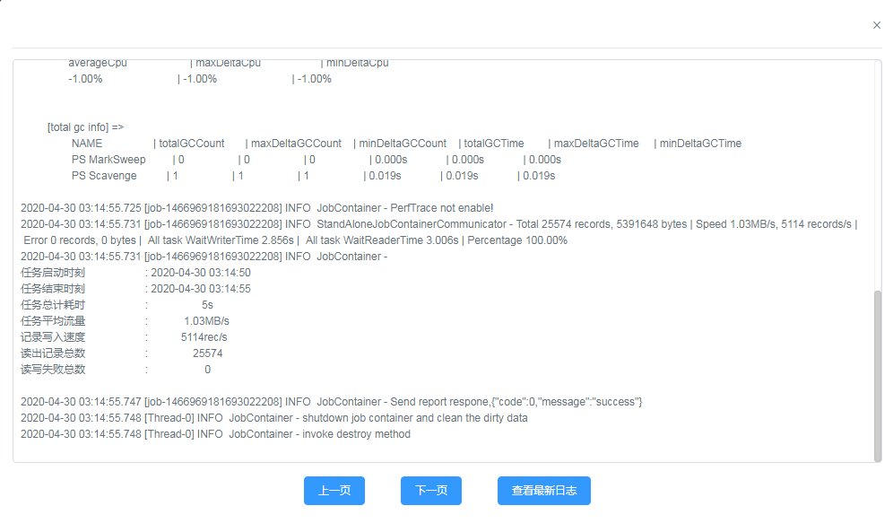

#### 系统管理模块
##### 1.应用用户管理
在`系统管理 - 用户管理`界面可以新增Exchangis平台的应用用户，并授权用户不同的角色，新用户可以预设密码：

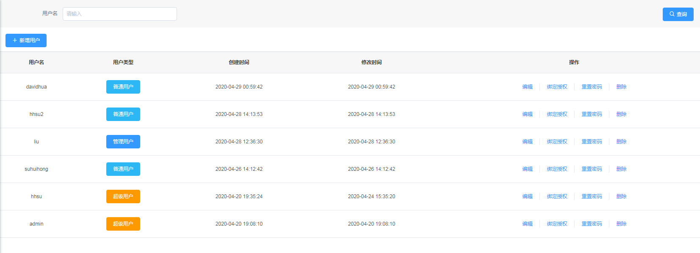

对于单个用户，可以绑定执行（代理）用户和执行服务节点：

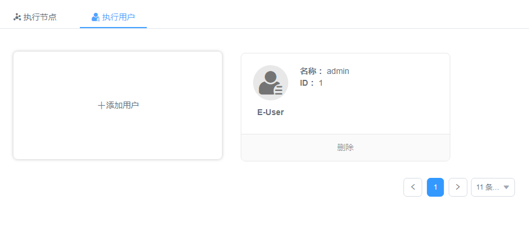

##### 2.执行(代理)用户管理
单独的界面维护系统内的执行（代理）用户：

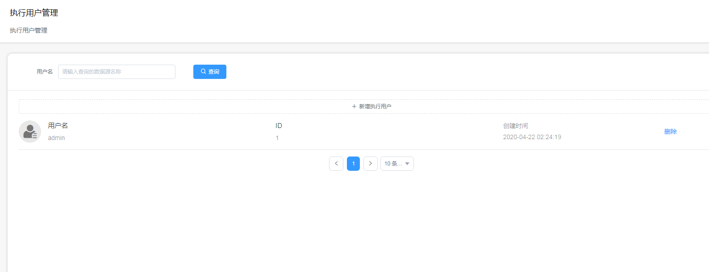

##### 3.执行节点管理
在`执行节点`界面可以看到当前集群存在的所有执行节点，这些服务节点通过心跳的方式自动更新自己的信息，点击对应的节点的`管理节点`按钮，进入如下界面：

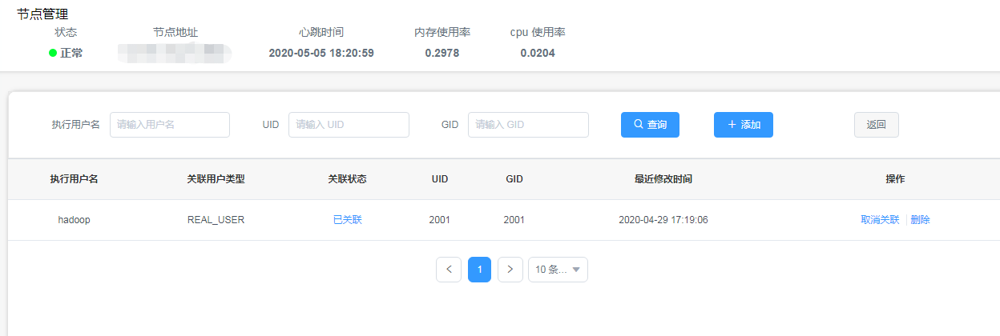

在该界面可以允许管理员绑定关联执行（代理）用户和执行节点，关联成功后，将会自动在节点机器上建立对应的系统帐号（目前只支持Linux发行版的系统）
#### 脚本接入（未开源）